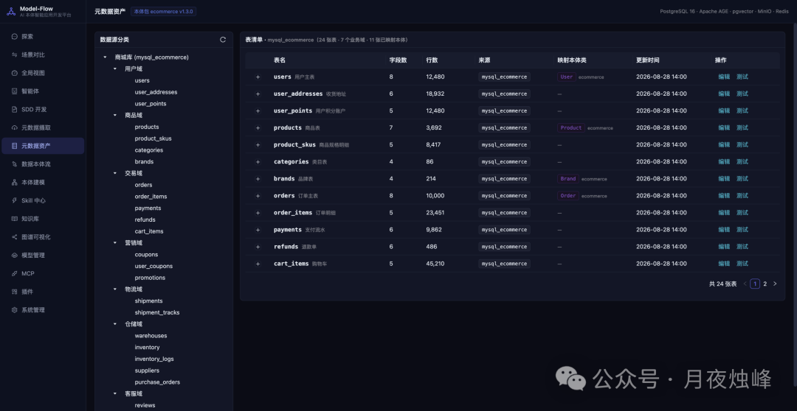
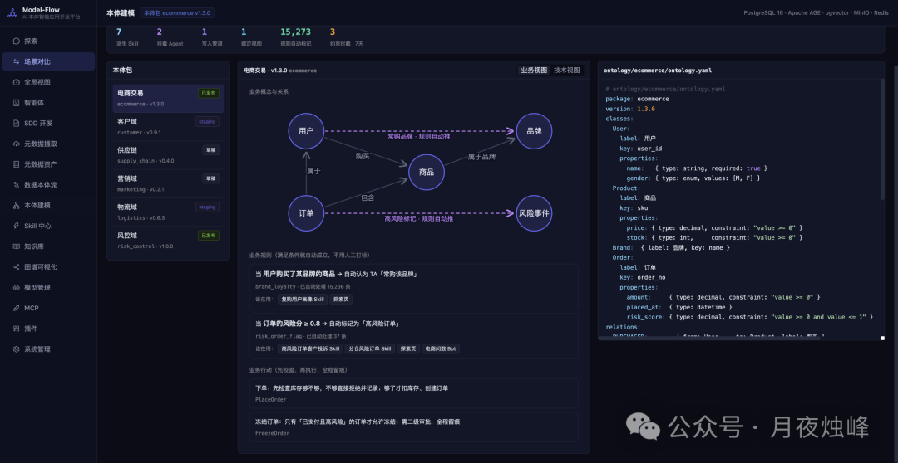
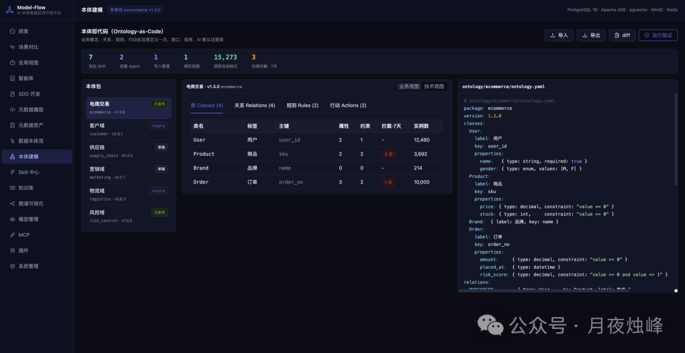
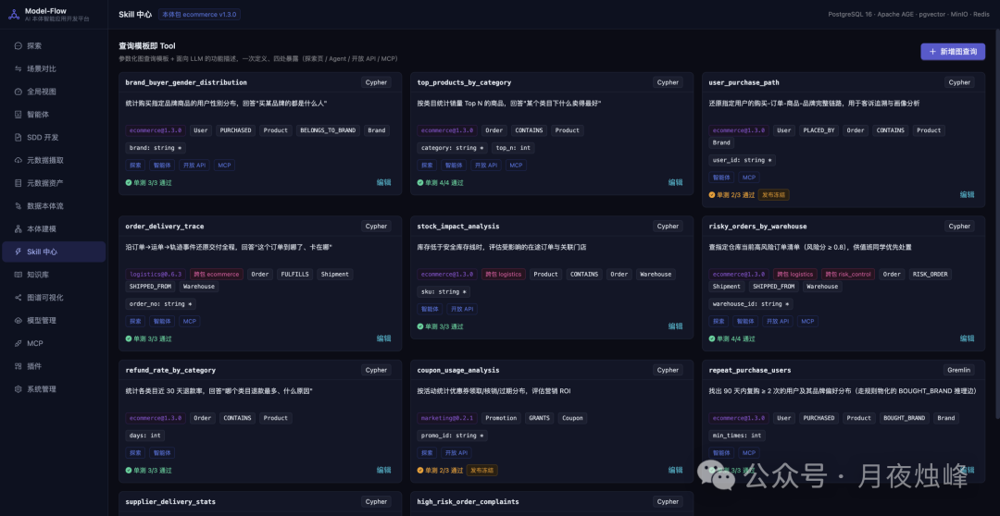
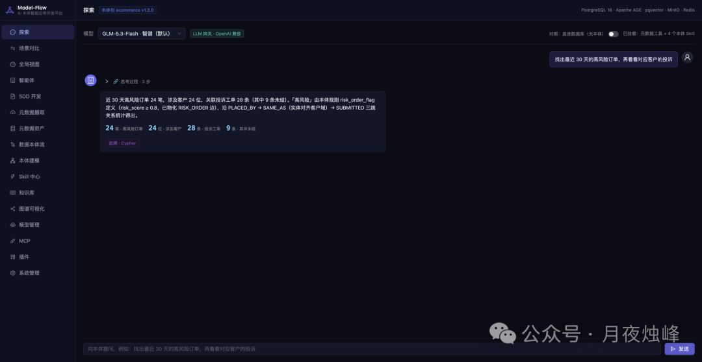
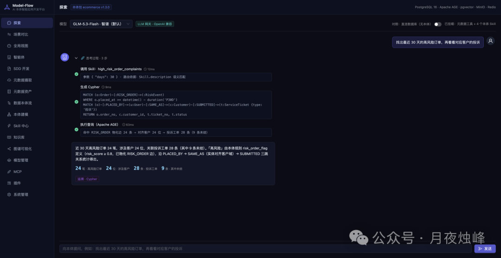
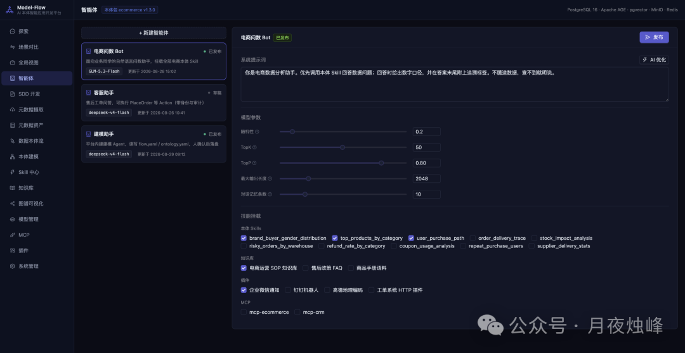
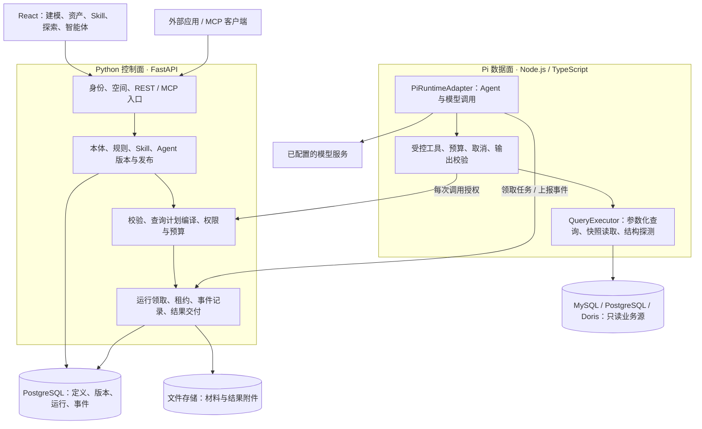
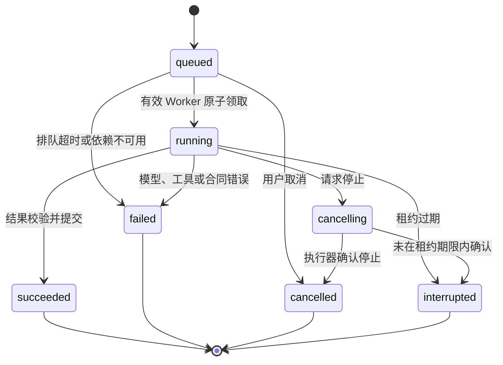
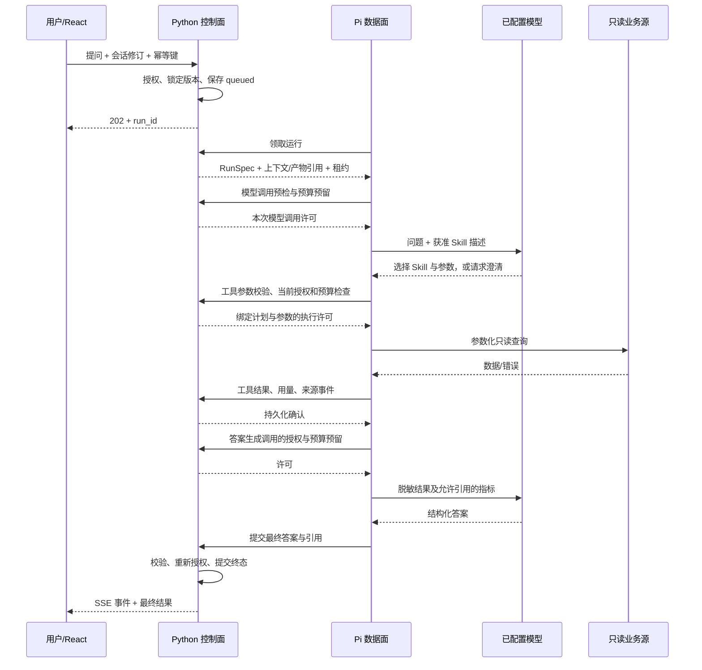

# OntoFoundry 企业本体智能平台完整设计

<!-- Hallmark · pre-emit critique: P5 H5 E4 S5 R5 V5 · genre: modern-minimal · macrostructure: Workbench · tone: technical/restrained/trustworthy · slop: pass for design specification; rendered implementation gates remain acceptance work -->

> 修订日期：2026-09-09
>
> 状态：唯一需求、产品、交互与架构基线  
> 本仓库不再维护精益版或平行设计；范围变化直接修订本文。
> 已进入正式实现；第 17 节列出实际验证结果与尚未完成的验收项。需求目标不等于已经上线。
> 第 1–16 节描述 V0.1 基线，第 17 节记录实现证据，第 18 节收录七张原型参考及分阶段需求，第 19 节定义 Python 控制面与开源 Pi 数据面的目标架构和实施合同。
> 阶段 A 已实施，生产联调仍有独立门槛；B0、B、C、D 均为待实现设计。第 19 节是后续架构的准则，不表示 Pi 已接入。

阅读入口：[现有实现与验证](#implementation-status) · [七张原型与产品需求](#prototype-supplement) · [Python / Pi 完整架构](#pi-control-data-plane) · [分阶段实施与回滚](#pi-delivery-plan)。

## 1. 结论先行

OntoFoundry 是一个独立部署的企业本体工程平台。首期面向能理解“实体、属性、关系”，但不了解 Apache Ossie、TBox/ABox、role、multiplicity、requires 和 derived_by 的产品经理。

V0.1 只交付一个可信闭环：

~~~text
Markdown / 数据库结构
        ↓
通用 Agent 对话与概念澄清
        ↓
Object、Link、Object Type、Link Type、属性、规则、约束和映射候选
        ↓
候选确认 + 人工编辑 + 来源证据
        ↓
本体图 / 实例图 / Diff / 严格校验
        ↓
整个工作空间发布为不可变版本
        ↓
标准 Apache Ossie JSON + OntoFoundry 完整快照
        ↓
本体服务：REST API + MCP
        ↓
应用与 Agent 统一消费
~~~

技术发布门槛是：生成的 Apache Ossie JSON 语法正确、通过固定版本的官方 JSON Schema，且语义 lint 没有 error。warning 必须展示但不阻塞发布。通过校验只说明结构与可确定引用正确，不代表业务语义必然正确。

首期验收把“能发布合法 JSON”作为硬退出条件，把“产品经理是否能独立完成”作为产品成功条件：用户无需理解 Ossie 术语，即可从 Markdown 形成有来源的候选，修正草稿，发布版本，并让应用通过 REST 或 MCP 读取同一份结果。

## 2. 产品边界

### 2.1 一个空间，一张图

V0.1 不保留“项目”“业务域”“子图”等长期实体。一个工作空间只有一张本体图；销售、客服、供应链等只是节点和关系上的多选标签，用于搜索、筛选和着色。

~~~text
工作空间（隔离与名称唯一性边界）
├── 一张本体模型图
├── 文档原生实例与事实
├── 数据库连接与本体映射
├── Markdown 材料库
├── 多个独立的 Agent 建模会话
├── 多个不可变的整体发布版本
└── REST API / MCP 服务配置
~~~

每个建模会话从一个已发布版本出发，拥有独立对话、候选区和会话草稿。不同会话互不覆盖；发布时与工作空间最新版本执行三方结构化合并。发布成功后，会话基线自动推进到新版本，用户可继续在原对话中增量建模。

### 2.2 四层对象模型

| 模型层 | 实例层 | OntoFoundry 责任 |
|---|---|---|
| Object Type | Object | 定义实体类型，并保存或查询其具体对象 |
| Link Type | Link | 定义关系类型，并保存或查询对象之间的具体关系 |

Apache Ossie 主要承载 Object Type、Link Type、属性、规则、约束和 ontology mappings。OntoFoundry 补充中文显示名、稳定 UUID、标签、Object、Link、来源证据和版本信息。

V0.1 的 Link Type 是有方向的二元关系，产品层只要求“起点 Object Type、关系名称、终点 Object Type 和基数”。同一类型自关联时可在高级区命名两端角色。需要三个及以上参与方的事实先建模为一个 Object Type，再用多个二元 Link Type 连接；V0.1 不提供独立的 n 元关系编辑器。

### 2.3 两类彼此独立的实例

| 实例来源 | 形成方式 | 存储与版本 | 用途 |
|---|---|---|---|
| 文档原生实例 | 从 Markdown 抽取 Object 和 Link，经用户确认 | 保存于 OntoFoundry，随空间版本发布 | 从实例归纳本体；没有数据映射时仍可浏览实例 |
| 数据映射实例 | 按 Object Type、属性、Link Type 到数据源、表、字段、主键、Join 的映射查询 | 不复制业务行，只版本化映射；映射不含连接凭据 | 实时查看数据库中已有实例及关系 |

两类实例可以在同一实例画布中展示，但通过来源样式区分，不自动做实体融合，也不把文档事实写回业务数据库。

### 2.4 明确不做

V0.1 不做：

- PDF、DOCX、TXT、OCR、图片或流程图解析；只接收 UTF-8 Markdown；
- 全量同步业务数据库实例、实例仓库或图数据库；
- 执行 derived_by 生成新事实，或建设完整规则推理引擎；
- 跨数据库连接 Join 或联邦查询；
- 审核流、发布审批、领域负责人或细粒度对象权限；
- Skill 市场、用户自定义 Skill 和第三方脚本沙箱；
- Action、Event、Automation、App 和工作流执行；
- 多模型路由、外部模型回退、向量数据库和 GraphRAG；
- Git 仓库式版本存储、Redis、Celery、Kafka 和微服务；
- 局部发布、项目级发布或子图独立版本；
- API/MCP 反馈箱、使用分析系统或自动反向建模；
- 手机端或窄屏完整建模；
- 自助回滚已发布版本；
- 通过 API 或 MCP 直接修改草稿、绕过候选确认或自动发布。

### 2.5 后续产品扩展的衔接

在上述边界内，先补齐实例值校验、消费端实例服务、版本选择与 Diff，并完善现有数据映射和本体视图。七张参考图中的业务 Skill、探索问数与智能体配置，作为后续只读业务应用阶段的需求，详见[原型参考与分阶段产品补充](#prototype-supplement)。这些需求不意味着 V0.1 已具备 Skill 执行、规则物化、跨源查询、Action 或 DAG。

本体继续作为业务定义的权威来源；新增能力按已发布本体版本建立依赖，沿用工作空间隔离。先完成一条可核验的业务查询链路，再扩展应用类型与执行范围。

用户于 2026-09-09 确认采用开源 Pi 核心运行时。后续增加 B0 运行时迁移阶段：Python 管定义、发布、授权与运行记录，Pi 管模型和业务工具执行。第 2.4 节的单 Provider、单进程等限制描述 V0.1；后续明确替换项以[双平面架构设计](#pi-control-data-plane)为准，规则物化、跨源查询、写操作和 DAG 仍受阶段 D 的独立条件约束。

## 3. 用户、权限和工作空间

### 3.1 用户角色

| 身份 | 能力 |
|---|---|
| 已登录非成员 | 查看工作空间目录和其他空间已发布的本体模型 |
| 空间成员 | 查看本空间材料、文档实例、映射与实例图；创建会话、建模、编辑和发布 |
| 空间管理员 | 拥有成员全部能力，并可管理成员、数据连接和空间设置 |

一个用户可加入和切换多个工作空间。任何通过内网 OAuth 登录的用户都可以创建空间并自动成为管理员。V0.1 不设置平台管理员。

为防止实例数据泄露，非成员不能查看材料、会话、草稿、文档实例、数据映射、数据库连接或实例图谱。

### 3.2 OAuth

认证复用现有内网系统中已验证的 OAuth2 Authorization Code 边界，但不形成运行时依赖：

- 单一可配置 Provider；
- state 加一次性 nonce HttpOnly Cookie 防登录 CSRF；
- 通过 OAUTH_USER_INFO 钩子适配内网用户信息；
- 使用 provider:sub 作为稳定身份，首次登录即时创建本地用户；
- 使用 HttpOnly、Secure、SameSite Cookie 保存会话；
- 回跳地址只允许本站相对路径；
- OAuth 只提供身份，空间角色由 OntoFoundry 管理。

## 4. 命名、身份与一致性

### 4.1 三种标识

| 字段 | 用途 | 是否进入 Ossie |
|---|---|---|
| 内部 UUID | 合并、历史追踪、引用更新 | 否 |
| 中文业务名 | UI、搜索、图谱和 Agent 对话 | 通过描述保留业务含义，不作为标识 |
| ASCII 技术名 | concept、relationship 和表达式引用 | 是 |

Object Type 和 Link Type 的中文业务名、ASCII 技术名在工作空间内分别全局唯一。比较前进行 Unicode 规范化、去首尾空白，并对 ASCII 技术名做不区分大小写的冲突检查。

模型项首次发布后仍允许修改技术名。内部 UUID 不变，平台同步更新可确定引用，Diff 标记重命名及影响范围，发布前重新校验。

### 4.2 唯一性范围

- Object Type、Link Type 的中文名和技术名：工作空间当前状态分别全局唯一；不同空间可同名；
- 属性名：只需在所属 Object Type 内唯一，以 ObjectType.property 形成限定名；
- Link Type 的端点角色名：只需在该 Link Type 内唯一；
- 历史版本不参与当前名称冲突判断；
- 精确同名候选识别为已有概念，只产生补充或修改候选；
- 语义相似但名称不同的候选提示合并，不自动合并；
- 草稿可暂存冲突，但必须标红且不能发布；
- 发布事务再次检查唯一性，不能只依赖前端。

### 4.3 实例身份

每个已发布 Object 必须绑定一个 Object Type，每个 Link 必须绑定一个 Link Type。若只从材料抽到实例，Agent 必须进一步提出 Object Type、Link Type 或属性候选，并保留实例到类型的绑定。

文档 Object 使用内部 UUID 和业务标识；数据库 Object 使用数据连接、数据集和标识字段值组成稳定引用。V0.1 不自动判断文档 Object 与数据库 Object 是否为同一现实对象。

## 5. 输入、证据与 Agent

### 5.1 Markdown 输入

- 仅支持 UTF-8 Markdown；
- 单文件默认上限 256 MB，单个会话所选材料累计默认上限 2 GB，部署时可调低；
- 按标题、段落、列表、表格和代码块确定性分块；
- 大文件流式上传、流式分块并分批进入模型，任何一次模型调用都受独立上下文上限约束，不把整批材料直接拼进一个 prompt；
- 图片只保留引用，不做 OCR；
- 外部链接不自动抓取；
- 相同 SHA-256 的文件在同一空间去重。

原始 Markdown 作为不可变源文件保存在服务器配置的数据目录，以 SHA-256 组织路径；文件元数据、规范化文本、标题结构和证据分块保存在 PostgreSQL。删除材料先检查是否仍被草稿或已发布证据引用；已被版本引用的源文件不能物理删除，只能从当前材料列表归档。备份必须同时覆盖 PostgreSQL 与数据目录。

Markdown 是待分析数据，不是 Agent 指令。文档中即使出现“忽略系统提示”“执行某工具”等文字，也不能改变 Agent 权限、系统提示或运行流程；只有用户在对话框中的消息可以发起动作。

### 5.2 通用 Agent 对话

中间区域是通用工作空间 Agent，不是固定向导。默认只读解释：说明概念、回答材料问题、查找已发布本体、解释校验错误。只有用户明确表达“开始建模”“把这些内容加入本体”“修改某概念”等意图时，才启动候选生成。

Agent 的模型修改始终先进入候选区，不直接改变会话草稿，更不能自动发布。

V0.1 内置：

- md2ossie：从材料生成保守的 Apache Ossie 候选，并执行官方 Schema 与语义 lint；
- ontology-clarifier：借鉴 grill-me 的逐步澄清方式，每次只追问一个高价值问题，将不确定信息转为待澄清项。

Skill 随应用版本只读发布。每次任务记录 Skill 版本、模型和输入来源。V0.1 不提供安装、编辑或执行用户 Skill 的入口。

### 5.3 自下而上的建模

文档建模不能只抽“类”，也不能只停留在实例：

~~~text
Markdown
  ↓
抽取 Object / Link 候选及证据
  ↓
聚类、比较与归纳 Object Type / Link Type / 属性候选
  ↓
复用已有类型，或提出新类型
  ↓
保留 Object → Object Type、Link → Link Type 的绑定
  ↓
用户确认后进入会话草稿
~~~

例如材料陈述“供应商 A 提供产品 B”：平台提出“供应商 A”和“产品 B”两个 Object、“供应商”和“产品”两个 Object Type、“提供”Link 及对应 Link Type，并保留类型绑定和原文证据；已有类型直接复用。

### 5.4 候选与人工编辑

候选单位包括：

- Object Type、Link Type、属性、规则、约束；
- 文档 Object、Link 及类型绑定；
- 数据映射；
- 重命名、删除和近义概念合并建议；
- 待澄清事项。

每项显示业务解释、结构化 Diff、影响对象以及文件、标题、行号和原文片段。首次生成可“一键接受全部无冲突项”；后续增量默认逐项接受，也支持按类型或来源批量接受。被忽略项保留，可恢复。

用户可绕过 Agent，直接在表单或图谱检查器中新增、修改和删除。人工编辑直接进入会话草稿并触发增量校验。

信息不足的规则留在“待澄清事项”，不写入 Ossie JSON，也不阻塞发布；发布页只显示未决候选和 warning 数量，不计算“材料陈述覆盖率”。确定性的 JSON 语法、Schema、引用、类型、名称和映射错误必须阻塞。

### 5.5 后台任务

任务状态只有：排队中、运行中、等待回答、已完成、失败、已取消。任务在服务器继续运行，关闭浏览器不会中断；前端轮询任务状态，重新打开页面即可继续查看。

同一会话中的变更任务按顺序执行；不同会话可以并行。设计容量约 10 个用户、峰值约 10 个并发任务。

## 6. 数据映射与实例图谱

### 6.1 数据连接

V0.1 直接连接：

- MySQL；
- PostgreSQL；
- Apache Doris（MySQL 协议）。

空间管理员配置只读连接。凭据用部署级主密钥加密，API 永不回传明文。连接测试和查询设置超时、限行和只读事务；只允许参数化 SELECT。

数据集是表或视图，字段是列。Object Type 至少映射标识字段；属性映射值字段；Link Type 映射同一数据源内的 Join 条件。跨数据源的 Link Type 可以存在于模型中，但实例图标记“不可查询”，不在应用内拼接两边大表。

映射写的是数据源名称、表、键列和字段列，不含连接标识与凭据：已发布版本因此可以在环境之间搬运，查询时再由工作空间把名称解析成配置好的只读连接。数据连接名称在空间内唯一；名称没有对应连接时，映射页与实例查询都明确提示未配置，而不是查询失败。

### 6.2 实例图谱

实例图谱是独立页面。用户可以：

1. 选择 Object Type；
2. 按数据库映射或文档实例搜索中心 Object；
3. 按已发布 Link Type 展开一到三跳已有 Link；
4. 在同一画布查看文档原生实例和数据库映射实例；
5. 打开节点或边，查看类型、属性、数据集/字段或文档证据。

数据库事实使用实线，文档事实使用点线；颜色之外同时显示来源图标和文字。V0.1 不自动融合两种来源，也不执行 derived_by 生成新 Link。

默认只加载一跳，用户主动继续展开。单次查询设置节点数、行数和执行时间上限，避免一次浏览演变成无界图查询。

## 7. 信息架构、交互与视觉

### 7.1 导航与页面外壳

登录后先进入工作空间目录。进入空间后的一级导航按产品经理能理解的本体工程对象组织为六项：

1. 本体视图：全局视图与语义视图两个页签，只浏览当前已发布版本；
2. 业务对象：Object Type 目录，以及对象详情、编辑、实例列表和实例详情的钻取入口；
3. 本体关系：Link Type 目录，以及关系详情、方向、基数和映射编辑；
4. 数据映射：Markdown 材料、数据库连接、数据集选择、对象映射和关系映射；
5. 本体自动构建：三栏工作台、建模会话和候选确认；
6. 空间设置：成员和空间配置。

“本体详情”“实例列表”“实例详情”是从业务对象进入的二级页面，不额外占用一级导航；用户始终可通过面包屑返回对象目录。数据映射既有独立入口，也会在对象或关系详情中以页签展示当前对象的局部映射，两处编辑同一份草稿数据。

“发布与服务”（版本、下载、REST API 与 MCP 接入说明）同样是二级页面，不占一级导航：发布是本体视图、对象目录和建模工作台上的操作，点“发布”进入这一页；全局视图的服务层也提供入口，非成员由此查看接口说明。发布能力、权限和校验门槛不变，改的只是入口位置。

不增加首页仪表盘。进入空间默认打开本体图谱；没有发布版本时显示空状态并引导创建建模会话。

页面外壳保持稳定，不因不同功能频繁改变布局：

~~~text
┌──────── 220px 空间与一级导航 ────────┬──────────── 当前页面 ────────────┐
│ OntoFoundry / 空间切换                │ 56px 页面标题、版本和主操作       │
│ 本体视图                              ├──────────────────────────────────┤
│ 业务对象                              │ 页面自己的工具栏与工作区          │
│ 本体关系                              │                                  │
│ 数据映射                              │                                  │
│ 本体自动构建                          │                                  │
│ 空间设置                              │                                  │
│ 用户与退出固定在底部                  │                                  │
└───────────────────────────────────────┴──────────────────────────────────┘
~~~

导航默认显示业务名称，沿用当前 AppShell 的侧栏收起与展开；收起时保留图标、名称提示和可访问标签。目录页只展示空间名称、说明、已发布版本和更新时间；成员空间可直接进入，非成员空间标记“仅本体可见”。目录为空时只给出“创建工作空间”一个主操作。

### 7.2 本体视图

本体视图只显示当前已发布版本，避免把草稿误认为企业标准。页面内部提供“全局”和“语义视图”两个页签，默认进入全局。两者使用同一份已发布模型，不形成两套本体，但必须使用不同的呈现方式，不能只改标题或叠一张统计卡。

全局沿用参考图“左侧层级索引 + 右侧透视层板”的布局，按本平台已确定的能力展示四层：服务层（REST API / MCP）、语义模型层（业务对象 / 本体关系 / 属性）、实例与证据层（文档实例 / 实例关系 / 来源材料）、数据映射层（已发布对象映射）。这是同一模型的阅读视角，不新增业务层存储、审批或执行引擎。服务名称表示提供的接口方式，不表示连接已启用或有调用流量；数据库实例按需查询，不编造全库实例数量。语义视图则是独立的二维 TBox 关系图。

全局左侧显示同一已发布快照的真实总数，右侧显示有限节点预览及已有的关系和映射连线。无实例或映射时保留空层并明确提示，不填充演示节点；非成员的实例和映射层显示“仅空间成员可见”，不能用 0 冒充无数据。选层可聚焦并进入相应业务入口，选本体节点打开详情检查器；支持缩放和适配。概览不受语义视图的标签和搜索影响。

以下搜索、筛选、邻域展开和检查器布局专用于语义视图；全局不放一排对分层总览无效的筛选控件。界面保留稳定导航与中央大画布，检查器由选择触发，不预占空白栏。

~~~text
┌──────────────────────────────── 顶部命令条 ────────────────────────────────┐
│ 本体图谱  v12 · 已发布   [搜索名称或定义] [类型] [标签]   [版本] [下载] │
├──── 图例/结果 280px ────┬────────────── 无限画布 ────────────┬─ 检查器 360px ┤
│ 匹配项与筛选摘要         │ 仅渲染当前筛选和展开范围          │ 业务详情        │
│ Object Type  18         │ 节点、关系、局部布局              │ 属性 / 关系     │
│ Link Type     24         │ 缩放、适配、仅看邻居              │ 规则 / 映射     │
│ 标签                     │                                  │ 来源 / 变更     │
└──────────────────────────┴──────────────────────────────────┴────────────────┘
~~~

左侧不是第二套导航，而是当前查询的图例、数量和匹配结果；没有搜索和筛选时默认折叠。右侧检查器由节点或边选择触发，未选择时不保留空白面板，让画布获得空间。标签只改变筛选和着色，不制造“子图”概念。

“语义视图”只呈现 TBox，不混入任何 Object、Link、数据库表或文档实例。画布上的节点只有 Object Type，边只有 Link Type 与继承；Value Type 是 Object Type 的字段，和规则、约束、映射一样属于检查器内容，不画成节点。属性画成节点会让画布的节点数翻三到四倍，把业务结构埋掉，而读者真正要看的是对象之间的关系。卡片右上角的计数和检查器里的属性列表负责回答“这个对象有多少属性、分别是什么”。全局中的实例、映射节点仅作成员可见的已发布预览；完整内容仍进入实例详情、独立实例图谱或对象映射页查看。

核心操作：

- 按中文名、技术名和描述搜索；
- 按 Object Type、Link Type、规则状态和标签筛选；
- 聚焦节点、仅看邻居、折叠或展开后继；
- 查看属性、关系、规则、约束、映射、标签和最近变更；
- 从节点发起“在会话中修改”；
- 查看当前版本 Diff 或下载 Ossie JSON。

已发布画布不直接编辑。图谱执行一次确定性力导向布局：同一模型每次得到同一张图，布局按最长轴摆正、按中位关系长度定密度，互不连通的部分各自布局后再装箱，最后消除卡片重叠；布局只在打开或模型变化时算一次，不自动漂浮或持续运动。关系线在卡片边界上浮动连接，同一对节点之间的多条关系按扇形分开，名称落在线上的胶囊标签里，可直接点选。点击节点只选中，双击或 Enter 聚焦一跳邻域；Esc 清除选择，`/` 聚焦搜索。搜索结果高亮并在结果列表定位，不能只靠缩放动画表达。超过 300 个可见节点时停止自动扩展，提示增加筛选条件。

节点编码同时使用形状、短标签和颜色：Object Type 为圆角矩形，Link Type 显示为带名称的关系线，继承为蓝色虚线。Value Type、规则、约束和映射都是检查器中的内容，不额外画成满屏节点。无发布版本时画布显示一句说明和“开始第一次建模”；无搜索结果时保留条件并提供“清除筛选”。

### 7.3 建模工作台

工作台采用三栏，不复刻参考图中的五步技术向导：

~~~text
┌──────────────┬────────────────────┬────────────────────────────────┐
│ 材料与会话   │ 通用 Agent 对话    │ 本体模型 / 语义图谱概览           │
│ 280px        │ 400px              │ 自适应主工作区，最小 640px       │
│ 上传/选择 md │ 解释、澄清、建模   │ Diff、表单、图编辑、发布准备度   │
└──────────────┴────────────────────┴────────────────────────────────┘
~~~

左栏上半区是会话列表，下半区是本会话材料。新建会话必须选择基线版本，默认最新已发布版本；没有版本时显示“空白基线”。材料通过上传、搜索和复选加入本次上下文，文件名旁显示处理状态、大小和是否已选。点击材料在右侧临时打开只读证据预览，不挤占对话区。

中栏默认是通用对话，保留明确的“开始建模”操作；运行时显示任务状态。不常驻展示内部 Skill 名、方法论名或“对话澄清，明确后开始建模”等重复说明，内部实现只在设置或技术文档中说明。用户明确要求开始或修改本体后，Agent 先复述目标和所选材料；只有高影响歧义才一次追问一个问题，其余不确定项生成待澄清候选。任务卡显示排队、运行、等待回答、完成、失败或取消；关闭页面后重开可继续。

右侧是主工作区，默认打开最近一次会话的“本体模型”，已有结果时直接展示，不要求用户重新执行建模。固定页签只保留“本体模型”和“语义图谱概览”：前者用同一列表承载候选、已接受草稿、待澄清和冲突状态，并在条目内展开结构化差异、文档实例、来源证据与数据库映射建议；后者只预览本次 Object Type、Value Type 与 Link Type 的语义影响，不显示实例或物理表。

JSON 预览、Schema 校验和语义 lint 是发布门槛，集中放在“发布与服务”（工作台顶部“发布本体”进入）的发布准备区；它们不再作为建模工作台的并列页签。版本历史同样放在“发布与服务”。这样右栏只回答两个问题：“模型具体变了什么”和“放进整张语义图后是什么结构”。

候选顶部保留业务对象（蓝）、本体关系（青）、属性（绿）三个目录计数，下面直接进入可展开明细。文档实例与实例关系放在同一列表下的候选组，提供值、引用及接受/忽略操作，不另加页签。规则缺少可靠表达式时内联待澄清，数据映射从对象编辑进入。颜色始终伴随名称和数字。新增、修改、待澄清和冲突用文字表达，不重复成另一组统计卡。

一次建模的主路径不是技术向导，而是三个可逆状态：

~~~text
Agent 形成候选 → 用户接受或忽略 → 草稿保存并持续校验 → 用户去发布页整体发布
~~~

不会用进度条暗示线性完成度，也不要求用户按固定步骤依次打开页面。顶部只显示事实：候选数量、草稿相对基线的修改数量、error/warning 数量和自动保存状态。

候选列表按“冲突 > 待澄清 > 修改 > 新增 > 实例”排序，可按类型和来源筛选。每项至少包含：业务名称、候选类型、一句话解释、结构化 Diff、来源定位、影响范围、置信提示和接受/忽略操作。置信提示用“证据充分 / 需确认 / 信息不足”，不展示伪精确百分比。

首次生成显示“一键接受全部无冲突项”，并明确列出不会被接受的冲突和待澄清项；后续增量默认逐项确认。接受后候选移入草稿并可撤销，忽略后进入可恢复列表。批量操作失败必须返回到具体条目，不出现只写“操作失败”的悬空 toast。

V0.1 使用 1280px 桌面工作台作为最小设计画布，不为窄屏重排导航或建模三栏。独立打开且容器宽度不小于 1280px 时按原尺寸显示；用于飞书文档等较窄容器预览时，整张工作台按容器宽度等比缩放，导航、内容和交互位置保持不变。等比缩放只解决原型嵌入与设计对齐，不代表 V0.1 支持手机端建模。

### 7.4 人工编辑表单

产品经理默认看到：中文名、定义、实体/属性/关系、目标对象、唯一性、必填性、标签、来源。技术名、role、multiplicity、identify_by、requires 和 derived_by 放在“高级”折叠区，并提供自然语言解释。

属性在产品中是一等对象，但编译时转换为实体到 ValueType 的 Apache Ossie relationship。表单模型是唯一来源，避免同时维护“属性”和“关系”两套互相漂移的数据。

编辑遵循“选中对象—局部修改—即时验证”：

- 从草稿列表或图谱选中 Object Type、Link Type、Object 或 Link，在右侧检查器编辑；
- 普通字段失焦后自动保存到服务器，顶部显示“保存中 / 已保存 / 保存失败”；
- 删除、改技术名、改标识字段等高影响操作先展示影响对象，确认后执行；
- 字段错误显示在字段旁，同时汇总到“校验”页签并可点击定位；
- 高级字段折叠不会隐藏已有 error，折叠标题必须显示错误数量；
- JSON 默认只读。只有启用“高级 JSON 编辑”后才可编辑，提交时解析为一次结构化草稿修改；失败时保留输入但不覆盖最后有效草稿。

两个用户编辑同一会话时使用草稿修订号做乐观锁。修订过期则显示“服务器版本 / 我的修改”的字段级差异，由用户保留一侧；不做实时协同光标、OT 或 CRDT。

### 7.5 实例图谱交互

实例图不是全量数据浏览器，而是“以一个实例为中心按本体关系展开”的查询工具。顶部先选 Object Type 和来源，再输入业务标识；结果列表确认中心 Object 后才进入画布。

画布初始只加载中心实例及一跳关系。节点菜单提供“展开下一跳”“仅看这条关系”“设为中心”；右侧检查器显示 Object Type、属性、来源、查询时间和文档证据或数据集字段。数据库事实用实线和数据库图标，文档事实用点线和文档图标；图例始终可见。

查询超时、超过节点上限或映射不可查询时，保留已加载结果并给出可执行的恢复动作，例如“缩小关系类型”“返回一跳”或“查看映射”。不把后端 SQL 或堆栈直接暴露给产品经理。

### 7.6 页面状态与反馈

| 状态 | 页面行为 | 用户下一步 |
|---|---|---|
| 首次空空间 | 本体图显示用途说明，主操作为“开始第一次建模” | 创建空白基线会话并上传 Markdown |
| Agent 运行 | 对话任务卡显示阶段和已用时间，其他区域仍可读 | 可取消，可离开页面 |
| 等待澄清 | 输入框聚焦到 Agent 的单个问题 | 回答、跳过并生成待澄清项 |
| 草稿已保存 | 顶部显示修订号与“已保存” | 继续编辑或查看校验 |
| 保存失败 | 保留本地输入，页面顶部常驻错误条 | 重试，不允许误报已保存 |
| 校验失败 | 页签显示 error 数量，发布按钮禁用 | 点击错误定位到字段或 JSON 路径 |
| 基线落后 | 显示最新版本及本会话差异 | 继续编辑；发布时三方合并 |
| 合并冲突 | 只冻结发布，不冻结会话阅读和导出 | 逐字段选择后重新校验 |
| 无实例结果 | 显示查询条件和可查来源 | 修改标识或切换来源 |
| 无权限 | 隐藏敏感内容并说明需要的空间角色或 scope | 返回目录或联系空间管理员 |

正常保存、接受候选和切换筛选不弹确认框；成功用就地状态表达，不连续堆 toast。可逆操作优先提供短时撤销；不可逆或高影响操作使用含对象名称和影响范围的确认框。

### 7.7 视觉系统

采用 Hallmark 的现代极简专业工具方向，目标是冷静、精确、可信。参考图只提供信息架构线索：稳定左导航、宽画布、顶部筛选和对象检查器；不继承发布会背景、人物视频、二维码、品牌、蓝色渐变或五步向导。

| 令牌 | 建议值 | 用途 |
|---|---|---|
| canvas | #F5F7FA | 应用背景和左导航 |
| surface | #FFFFFF | 画布、检查器和输入区域 |
| ink | #172033 | 主文字 |
| muted | #667085 | 次要说明 |
| border | #D9E0EA | 分区与控件边界 |
| cobalt | #2457D6 | 唯一主操作、选中和键盘焦点 |
| cyan | #0E91A7 | 图谱局部聚焦，面积不超过画布 3% |
| success / warning / danger | #18864B / #A86200 / #C63C3C | 仅语义状态，并与图标、文字并用 |

- 字体只使用两种角色：品牌和正文用系统中文无衬线字体（PingFang SC / Microsoft YaHei / Noto Sans SC fallback）；技术名和 JSON 用系统等宽字体。通过字号和字重建立层级，不依赖外部字体 CDN；尚未打包的字体不能宣称已自托管；
- 采用 4px 间距基线，常用间距为 8、12、16、24、32；导航行、输入和按钮高 44px，点击目标不小于 44px；
- 圆角只用 4、6、8px，不使用大胶囊；状态标签可以是小圆角矩形；
- 主层级依靠留白、1px 边界和背景差建立，浮层才使用克制阴影；不为每个字段创建卡片；
- 页面级只允许一个实心主按钮；次级操作使用描边或文字按钮；破坏性操作不会与主按钮同色；
- 图标必须配可访问名称，颜色不能独立承载类型、来源、Diff 或校验状态；
- 正文和控件满足 WCAG AA 对比度，键盘焦点为 2px cobalt 外环，Tab 顺序遵循左栏—对话—主工作区；
- 加载使用骨架或局部进度，避免整页旋转器；尊重 prefers-reduced-motion。

动效只解释状态变化：悬停和选中 120–160ms，检查器进入 180–220ms；图谱聚焦可以平移，但不使用弹簧、视差、发光、持续脉冲或庆祝动画。按钮文案使用“接受候选”“保存草稿”“发布版本”等动词，不使用“好的”“下一步”“魔法生成”等模糊或拟人化措辞。

界面只复用通用的信息架构规律，不复制第三方产品的商标、Logo、截图、文案、图标或特有视觉资产。最终设计使用 OntoFoundry 自有名称、设计令牌和组件。

## 8. 发布、版本与合并

### 8.1 发布单位

每次发布整个工作空间，生成：

1. 不可变 OntoFoundry 快照：TBox、文档 ABox、数据映射、标签和平台元数据；
2. 确定性排序和格式化的标准 Apache Ossie JSON；
3. 校验报告、发布人、时间、基线和变更摘要；
4. 同一版本对应的 REST API 与 MCP 可查询快照。

数据库实时 Object 和 Link 不进入快照。

### 8.2 三方结构化合并

不引入 Git。发布使用基准版本 B、当前版本 L 和会话草稿 D：

- 以内部 UUID 对齐 Object Type、Link Type、文档 Object、Link 和映射；
- 只修改一侧的字段自动合并；
- 双方做相同修改直接合并；
- 双方对同一字段做不同修改形成冲突；
- 删除与修改同一对象形成冲突；
- 名称冲突、类型不兼容和引用断裂属于语义冲突。

冲突界面并排显示基准、最新版和本会话。解决后重新合并与校验。

### 8.3 原子发布

发布事务：

1. 锁定工作空间发布指针；
2. 读取 B、L、D 并三方合并；
3. 检查名称、引用、类型绑定和映射；
4. 编译 Ossie JSON；
5. 执行官方 Schema 和语义 lint；
6. 写入不可变版本并更新当前版本；
7. 将会话基线推进到新版本；
8. 提交事务并广播版本变更。

任何一步失败都不改变当前发布版本。历史版本可查看、比较和下载。V0.1 不提供自助回滚；极少发生的误发布由运维从不可变快照人工恢复，并产生一个新版本，不删除历史。

## 9. Apache Ossie 编译与校验

V0.1 固定 Apache Ossie ontology specification 0.2.0.dev0。官方 `ontology/ontology.json` 是 Draft 2020-12 JSON Schema，并引用同一仓库的 core schema 定义；规范、两份 Schema 和官方校验器固定到同一明确提交，运行时不从公网拉取，升级通过显式迁移完成。

`md2ossie` 已从 Ossie Visualizer 的 `.claude/skills/md2ossie` 迁入本仓库。它包含方法论、模板、固定 Apache Ossie 提交的官方规范与 Schema、离线 `$ref` 适配器、semantic lint 和 13 个自动化测试。迁入版本固定来源提交并保留 Apache-2.0 LICENSE、NOTICE、上游文件哈希和 provenance。

平台复用其保守建模方法、官方资产和校验实现，但发布门禁仍由本设计统一定义：error 阻塞，warning 明示但不阻塞。Skill 在独立命令行交付时使用 `--strict` 追求 0 warning；平台集成调用不使用 `--strict`，避免把可人工判断的建议伪装成 Schema 硬错误。

内部模型编译遵循以下映射：

| OntoFoundry 内部模型 | Apache Ossie 0.2.0.dev0 输出 |
|---|---|
| Object Type | `ontology[]` 中 `type: EntityType` 的 component |
| Object Type 的 `extends` | component 的 `extends`（父概念技术名） |
| 普通属性 | 所属 EntityType 中指向内置值概念的 relationship，不额外包装 ValueType |
| 标识属性 | 一个 `ValueType` component（`extends` 内置值类型），加指向它的 relationship，并进入 `identify_by` |
| Link Type | 首 role 概念的 component 中的一条 relationship，终点和自关联角色编译为 roles，基数编译为 multiplicity |
| 标识关系（Link Type 的 identifier） | 该 relationship 的名字进入所属 component 的 `identify_by` |
| 约束 | ontology、component 或 relationship 的 `requires` |
| 派生规则 | component 或 relationship 的 `derived_by`，V0.1 只表达和校验引用，不执行 |
| 自然语言读法 | relationship 的 `verbalizes`；模型没有存读法时按名称模板生成 |
| 中文名、标签、属性必填 | `ai_context.ontofoundry` 命名空间扩展 |
| 数据映射 | `ontology_mappings`：每个数据源一份 OntologyMap，表与键列进 `semantic_model.datasets`，属性列进 dataset 字段与 `link_mappings`，关系 Join 进 `semantic_model.relationships` |
| Object、Link、UUID 和证据 | 只进入 OntoFoundry 快照，不写入 Ossie JSON |

- 只从有证据的材料生成概念、关系和表达式；
- 无真实逻辑模型证据时不猜 ontology mappings；
- ValueType 必须直接或间接继承内置值类型；
- 检查继承类型与循环、角色引用、关系限定名、role 歧义、multiplicity 和 identify_by；
- requires、derived_by 除可确定引用外，不宣称完成业务语义验证；
- JSON 语法和官方 Schema 通过且语义 lint 0 error 才可发布；warning 展示但不阻塞。

UUID、证据和文档 Object/Link 不写入 Ossie schema。编译器确定性输出，确保相同快照得到相同 SHA-256。

中文显示名、标签和属性必填标记在标准里没有字段，但它们是界面的主要读物。官方 schema 在除 `ai_context` 之外的每一层都禁止额外属性，而 `ai_context` 明确是开放对象，因此导出把这三项放进 `ai_context.ontofoundry`（`display_names`、`tags`、`required_attributes`）。这是带命名空间的扩展：其他消费方可以完全忽略，导入没有它也能工作，只是业务名称退回 concept 名称。UUID、文档实例和证据仍然只在 OntoFoundry 快照里。

### 9.1 Ossie 构造到内置模型的对照

内置模型按 Ossie 的构造扩展过一轮，目标是双向翻译：本平台导出的文件重新导入后得到同一个模型，外部文件导入后仍能编译回通过官方 Schema 与语义 lint 的 Ossie。下表是权威对照，“状态”一列说明这条构造是否往返无损。

| Apache Ossie 构造 | 内置模型 | 状态与说明 |
|---|---|---|
| `EntityType` component | 业务对象（Object Type） | 双向无损。concept 作技术名，中文名来自扩展，缺失时用 concept |
| `extends`（实体继承） | Object Type 的 `extends`（多父） | 双向无损。子对象只存自己新增的属性与关系，继承链上的内容按需解析；校验拒绝环与重名 |
| `ValueType` component | 属性的 `value_kind` + `value_concept`（概念名） | 名称与共用关系双向无损：属性记住它指向的值概念名，导出时按同一个名字写回一个 component，多个属性共用则仍是一个概念。有损的只有值概念自带的 `requires`/`derived_by` 和 `extends` 链上的中间概念（导出统一写成直接继承内置类型），这两种情况才提示 |
| 内置值概念 String/Integer/Decimal/Float/Boolean/Date/DateTime | 七种 value_kind | 双向无损 |
| 内置实体 `Any` | 无 | 不支持：指向 `Any` 的关系跳过并报告，它没有对应的业务对象 |
| relationship（role 指向值概念） | 属性 | 双向无损 |
| relationship（role 指向实体） | 本体关系（Link Type） | 双向无损。关系名在 Ossie 是概念内的局部名，内置模型同样只要求在所属概念内唯一（属性与关系共用一个命名空间，并对子类型生效） |
| roles 数量 ≠ 1（一元、三元及以上） | 无 | 不支持：跳过并报告，内置模型只有二元关系 |
| `multiplicity`：ManyToOne / OneToOne / 省略 | many_to_one / one_to_one / many_to_many | 双向无损。内置 one_to_many 在导出时翻转两端写成 ManyToOne，导入回来是语义等价、方向相反的 many_to_one |
| `identify_by`（指向属性关系） | 属性的 identifier | 双向无损，含复合标识 |
| `identify_by`（指向实体关系） | Link Type 的 identifier | 双向无损。这是 Ossie 的 referent identification（如订单行由订单加行号标识）；校验要求这条关系是多对一或一对一 |
| `requires`（ontology / concept / relationship） | 本体、对象、属性、关系上的 `requires` | 双向无损。表达式按文本存储，由官方语义 lint 校验引用，平台不执行 |
| `derived_by` | 对象、属性、关系上的 `derived_by` | 双向无损，同上，不执行 |
| `verbalizes` | 属性与关系上的 `verbalizes` | 双向无损，原样存取，不解析也不改写占位符。与标准模板一致的读法不存储（避免改名后留下陈述旧名的死文本）。这条成立的前提是导入不给概念改名：值概念按原名写回，读法里的 `{值概念}` 才仍是这条关系的合法 role |
| `ai_context` | 空间名称与描述 + `ontofoundry` 扩展 | 单向：导出生成 instructions/synonyms，导入只读取扩展 |
| `ontology_mappings` + `semantic_model` | 数据映射（数据源名称、表、键列、字段字典）与关系的 Join 列 | 双向无损，限于单列表达式。dataset 名用概念的技术名，`source` 是 `schema.table`，键列取 `primary_key` 或对象映射表达式，属性列取 `link_mappings` 的对象映射表达式。计算列、`referent_mappings`、多层 `link_mappings` 报告后跳过，不从任意 SQL 里猜列名 |
| 无对应 | UUID、文档实例、实例关系、证据 | 标准里没有这些构造，只存在于 OntoFoundry 快照；支持范围内的关系 Join 列随上一行映射往返 |

同一个名字在两侧的含义不同，值得单独点明：Ossie 的 `description` 是一句解释（“采购、生产与库存环节管理的物料。”），内置模型的“中文名”是一个短标签（“物料”），用于图上节点、目录行和搜索，并且要求唯一。把标签写进 `description` 会让往返后的节点标签变成一整句话，所以标签放在 `ai_context.ontofoundry.display_names`，`description` 保持原义。

导入生成建模会话草稿，不直接改动已发布模型；发布仍是单独的显式操作。两种方式：合并按技术名新增或更新，保留文件之外的对象、文档实例和数据映射，并保留本地中文名；替换只保留文件内容，文档实例与数据映射不会带入，发布后文件之外的对象会消失。文件必须先通过官方 JSON Schema，否则整份拒绝。对象与属性的 UUID 由工作空间 ID 和 concept 名派生，同一个文件重复导入得到同一批标识。

### 9.2 内置模型为支持双向翻译新增的字段

| 字段 | 位置 | 作用 |
|---|---|---|
| `extends: [UUID]` | Object Type | 继承父概念；实例可用于父概念声明的关系端点，属性按继承链解析 |
| `identifier: bool` | Link Type | 这条关系参与标识来源对象，编译进 `identify_by` |
| `requires: [表达式]` | 本体、Object Type、属性、Link Type | 约束表达式，纯文本存储 |
| `derived_by: [表达式]` | Object Type、属性、Link Type | 派生表达式，纯文本存储 |
| `verbalizes: [读法]` | 属性、Link Type | 手写自然语言读法；为空表示按模板生成 |
| `value_concept: str?` | 属性 | 属性指向的 Ossie 值概念名；为空表示由编译器决定（内置类型，或标识属性的生成名）。校验要求同名值概念的值类型一致，且不与业务对象技术名冲突 |
| `connection_alias: str` | 数据映射 | 取代原来的 `connection_id`：模型只写数据源名称，凭据与连接配置留在工作空间，查询时按名称解析 |

表达式和读法都有长度与条数上限，避免把整段文档塞进模型。平台不解析、不执行表达式：语义由官方 lint 在发布门槛处检查，业务正确性仍需人工复核。

## 10. 本体服务：REST API 与 MCP

### 10.1 服务边界

发布是服务化的唯一入口。REST API、本体图谱和 MCP 都从同一个已发布版本读取，不各自建立索引语义或数据副本。

V0.1 的本体服务只读：

- 可查询当前版本或指定历史版本的 Object Type、Link Type、属性、规则和约束；
- 可按中文名、技术名、别名和标签搜索；
- 可查询类型图邻域；
- 有 instances:read 权限时，可查询文档 Object/Link 和数据库映射 Object/Link；
- 有 instances:read 权限时，可在详情中查看已发布证据片段；
- 不可创建候选、修改会话草稿、接受候选或发布。

模型消费方需要可复现时必须传入 version_id；省略时读取当前版本。所有响应都返回 workspace_id、version_id 和 version_sha256。

### 10.2 REST 服务 API

建模管理接口与本体服务接口分开。外部应用只查询已发布数据：

- GET /api/v1/ontology/workspaces/{id}/version：当前版本摘要；
- GET /api/v1/ontology/workspaces/{id}/types：按类型搜索和分页；
- GET /api/v1/ontology/workspaces/{id}/types/{typeId}：Object Type 或 Link Type 详情；
- GET /api/v1/ontology/workspaces/{id}/type-graph/neighborhood：类型邻域；
- GET /api/v1/ontology/workspaces/{id}/objects：实例搜索；
- GET /api/v1/ontology/workspaces/{id}/objects/{ref}：实例详情；
- GET /api/v1/ontology/workspaces/{id}/objects/{ref}/neighborhood：实例关系展开；
- GET /api/v1/ontology/workspaces/{id}/versions/{versionId}/export：下载标准 Ossie JSON。

导入属于建模管理接口，不在只读服务里：POST /api/v1/workspaces/{id}/imports/ossie 接收一份 Ossie JSON 和 `mode`（merge/replace），成员权限，返回新建的建模会话、导入报告和校验结果；它不会发布任何版本。

列表统一使用游标分页；实例邻域显式限制深度、节点数、行数和超时。证据引用和短片段随类型或实例详情返回，不设置独立证据接口。API 不提供任意 SQL、任意图查询语言或直接下载完整源文档。

### 10.3 MCP Server

MCP 是 REST 之上的薄适配器，与 REST 共用 OntologyQueryService、权限检查、查询限制和审计记录，不在 MCP 工具中复制业务逻辑。

V0.1 暴露的 MCP tools：

- get_ontology_version；
- search_types；
- get_type；
- expand_type_graph；
- search_objects；
- get_object；
- expand_object_graph。

工具返回紧凑结构化结果；证据引用随类型或实例详情返回，不另设 MCP resource 或证据工具，也不把整张图或整份材料一次塞入 Agent 上下文。

远程 MCP 使用官方 2026-07-28 Streamable HTTP：单一 `POST /mcp` 端点，每个 JSON-RPC 请求是一次独立 HTTP 请求，返回 JSON 或请求级 SSE；协议本身无初始化握手和会话，不实现已被替代的旧 HTTP+SSE 双端点。服务校验 Origin、`MCP-Protocol-Version`、`Mcp-Method`、按需的 `Mcp-Name`、请求元数据与请求体大小。

### 10.4 认证、权限与审计

REST 与 MCP 均使用 Authorization Bearer，不在 URL 中传 token。MCP 端点发布 OAuth Protected Resource Metadata，复用内网 OAuth/OIDC Provider；用户客户端采用 Authorization Code + PKCE，系统客户端采用预注册的 Client Credentials。

服务授权按工作空间和 scope：

- ontology:read：查询已发布 TBox；
- instances:read：查询文档和数据库 ABox，并查看关联证据片段。

instances:read 只授予空间成员或明确绑定该空间的服务主体。数据库凭据、草稿、对话和未发布候选永不通过本体服务暴露。

服务只保留排障与安全审计所需的标准访问日志：请求 ID、主体、工作空间、版本、操作、耗时和错误码，不记录数据库密码或完整敏感结果。

### 10.5 服务闭环

~~~text
材料与数据结构
   → Agent + 人工建模
   → 版本、冲突与发布管理
   → REST / MCP 查询服务
   → 应用与 Agent 使用
~~~

这里的闭环是能力链路完整，不表示服务会自动反向修改本体。后续变化由用户正常发起建模会话，已发布版本始终不可变。

## 11. 技术架构

### 11.1 组件

以下是 V0.1 / 阶段 A 的现有架构。目标部署增加独立 Pi 数据面，组件责任、通信、迁移与退出条件见第 19 节；本节的进程内任务方式只用于现有实现及迁移期间的旧路径。

~~~text
React Web ─────HTTP──── FastAPI ───── PostgreSQL
                         │
                         ├──── Server File Storage（原始 Markdown）
                         ├──── Anthropic-compatible 内网模型
                         ├──── Ossie 编译与校验
                         └──── MySQL / PostgreSQL / Doris（只读）

进程内异步任务 ───── modeling_sessions 状态
REST Clients ──Bearer── Ontology Service API
MCP Clients  ──Bearer── Streamable HTTP /mcp
~~~

- 前端：若许可证和代码审计通过，复用既有可视化代码中的 React Flow、布局和检查器思想；否则按本设计重建，不形成对原工程的运行时依赖；
- API：FastAPI，负责 OAuth、空间、材料、会话、发布和只读本体服务；
- MCP：挂载于同一服务进程的薄协议适配器，共用查询服务；
- PostgreSQL：结构化状态、规范化文本、证据分块和版本快照；
- Server File Storage：部署服务器上的内容寻址数据目录，只保存不可变原始 Markdown；
- 后台任务：单 API 进程内异步运行，10 个模型请求并发槽；进度与候选写回会话。重启标记中断并供人工重试；不设 Worker 租约或自动重领；
- 模型：单个 Anthropic-compatible 内网 Provider；
- 业务数据：MySQL、PostgreSQL、Doris 只读连接。

所有代码、Schema、Skill 和静态资源迁入 OntoFoundry，不在运行时引用其他工程的绝对路径。迁移 Apache-2.0 代码和 Apache Ossie vendored 规范时保留 LICENSE、NOTICE、来源提交和修改说明。

### 11.2 为什么只有 PostgreSQL 一个数据服务

数十到数百个类型、约 10 个用户和约 10 个并发任务不需要图数据库。PostgreSQL 保存 JSON 快照、分块、会话、候选和任务状态；原始文件留在服务器数据目录，图布局在浏览器完成。当前发布使用行级锁和修订号比较，不运行独立任务领取器。B0 将使用同一个 PostgreSQL 保存运行记录并由控制面提供领取与租约 API，不额外引入消息中间件。开发与契约测试允许 SQLite；不能用它替代 PostgreSQL 并发验收。

核心表：

| 表 | 责任 |
|---|---|
| users | OAuth 身份 |
| workspaces、workspace_members | 空间与角色 |
| materials、material_chunks | 文件哈希与磁盘位置、文本和证据分块 |
| modeling_sessions | 基线版本、草稿、候选、消息、材料选择、修订号与后台任务状态 |
| ontology_versions | TBox、文档 ABox、映射、Ossie JSON 和校验报告 |
| data_connections | 加密连接配置 |
| service_tokens | 令牌哈希、所属空间、名称、撤销状态；只读 TBox |

### 11.3 建模与管理 API

- /api/v1/auth：OAuth、当前用户、退出；
- /api/v1/workspaces：目录、创建、成员；
- /api/v1/workspaces/{id}/materials：材料上传、目录与原文；
- /api/v1/workspaces/{id}/sessions：会话与草稿；
- /api/v1/workspaces/{id}/sessions/{sessionId}/messages、cancel：对话、建模与取消；
- /api/v1/workspaces/{id}/sessions/{sessionId}/candidates：接受、忽略和恢复；
- /api/v1/workspaces/{id}/sessions/{sessionId}/validate、resolve-merge、publish：校验、冲突选择与整体发布；
- /api/v1/workspaces/{id}/versions：查看、比较和下载；
- /api/v1/workspaces/{id}/connections：连接、Schema 浏览和映射；
- /api/v1/workspaces/{id}/mapping-preview：参数化对象预览；
- /api/v1/workspaces/{id}/instance-neighborhood：数据库中心实例与 1–3 跳邻域；
- /api/v1/workspaces/{id}/published-snapshot：成员读取完整发布快照，文档实例从其中浏览。

## 12. 可靠性：按真实频率投入

本节是 V0.1 的恢复策略与容量假设。第 19 节因进程隔离补充租约、事件确认和取消协议，仍保留显式重试，不引入模型任务自动重跑或分布式事务。

以下是设计假设，不是假装已有线上统计；上线后用任务状态和错误码校准。频率按“同类操作”分别计算，例如一百万次 Agent 任务、一百万次发布或一百万次实例查询，不能把高频读请求与低频发布混成一个分母。

| 规划频率桶 | 典型情况 | 处理方式 | 不做什么 |
|---|---|---|---|
| 约 99 万/100 万任务都会遇到 | 材料重复、歧义、缺字段；同名已有概念；实例需要归纳类型 | 去重、匹配、证据、待澄清和候选确认作为主流程 | 不把正常不确定性当异常重试 |
| 最多约 10 万/100 万请求 | 页面关闭、重复点击、模型 429/5xx/超时、进程中断、基线变旧、实例或服务查询超时 | 服务端草稿、修订号比较、人工重试、三方合并、限时限行 | 不自动重跑模型，不静默覆盖，不引入分布式事务 |
| 约 1–2/100 万操作 | 数据库损坏、管理员误删空间、Ossie 规范不兼容升级、主密钥丢失 | 监控、每日备份、固定规范版本、人工恢复与事故流程 | 不建设自动跨库自愈、双活或复杂补偿 |

V0.1 不自动重试模型请求；网络、429、5xx、认证和输入问题都保留明确状态，由用户选择重试。模型请求代价高且不保证幂等，当前没有证据证明自动补偿值得引入。进程重启不自动重跑；取消后以 run_id 隔离迟到结果。实例查询超时提示缩小范围，发布失败依赖事务回滚，语义错误通过证据和人工修正处理。

自动处理仅覆盖确定性操作：SHA 文件去重、请求修订号比较、事务回滚、重新读取已保存草稿。以下情况由部署巡检发现：长时间排队或运行的任务、连续连接测试失败、数据库与源文件备份缺失、数据库记录指向不存在的源文件、版本快照与 SHA-256 不一致、异常增长的 error/warning。巡检只告警，不自动改本体；巡检脚本和生产告警接入尚待部署验收。

以下极低频问题由人工修复足够：误发布、错误的数据映射、失效连接、规范升级失败和备份恢复。修复都通过新版本或运维记录留下痕迹，不原地改写历史。只有当同类故障经过线上数据证明达到中频、人工恢复时间不可接受，并且补偿动作可幂等验证时，才升级为自动补偿。

频率不能豁免安全和数据完整性。越权访问、明文凭据、提示注入触发工具、发布半成功即使预计极少发生，也必须由权限校验、加密、事务和测试预防；这是后果边界，不是高可用堆料。

## 13. 开源项目对标

截至 2026-09-04，公开项目中没有发现一个同时完整覆盖“产品经理友好的 Markdown Agent 建模、Apache Ossie、可视化人工编辑、版本合并、文档 ABox、数据库映射与实例图谱”。应组合借鉴，而不是选择一个大项目作为整套底座。

下表仅基于项目官方仓库的公开说明和提交记录做技术调研，不表示独立质量背书，也不表示复制其品牌与界面；stars 为 2026-09-04 的约数，随时间变化。实际复用必须单独核对许可证、依赖和 NOTICE。

| 项目 | 活跃度信号 | 做得好的地方 | 对 OntoFoundry 仍缺什么 |
|---|---|---|---|
| [Apache Ossie](https://github.com/apache/ossie) | 约 2k stars；2026-09-02 有提交 | 轻量、厂商中立的语义模型与本体映射规范，附 Schema 和校验器 | 不是编辑器、运行时、版本系统或实例图 |
| [Semantica](https://github.com/semantica-agi/semantica) | 约 11.8k stars；2026-09-03 有提交 | 官方仓库覆盖摄取、OWL/SHACL、溯源、图存储、REST 和 MCP | 项目年轻、能力面过宽；自述能力需逐项验证，且不是 Ossie 原生工作台 |
| [WebProtégé](https://github.com/protegeproject/webprotege) | 约 0.8k stars；2026-07-28 有构建维护提交 | 成熟的 OWL 协作编辑、变更记录和权限体验 | 面向本体专家；主仓库正在组件化演进，业务材料 Agent 和 Ossie 支持不足 |
| [TerminusDB](https://github.com/terminusdb/terminusdb) | 约 3.4k stars；2026-05 项目说明更新并引入新维护者 | 版本化图数据、schema 和 Diff 思路完整 | 是图数据库底座，不是轻量 Ossie 工作台，引入后会扩大运行和查询体系 |
| [TypeDB](https://github.com/typedb/typedb) | 约 4.4k stars；2026-09-01 有提交 | 强类型关系、Schema、规则和查询语言 | 自有数据库和查询体系较重，替换不了面向产品经理的候选确认流程 |
| [DataHub](https://github.com/datahub-project/datahub) | 约 12.6k stars；2026-09-03 有推送 | 元数据图谱、术语、治理和资产检索 UX | 重点是数据目录和治理，不是形式化本体编辑与文档实例平台 |
| [OntoGPT](https://github.com/monarch-initiative/ontogpt) | 约 1k stars；2026-06-22 有提交 | 模板约束的 LLM 结构化抽取、证据和本体术语复用 | 偏 Python 与生物医学管线，不是多用户可视化工作台 |
| [Microsoft GraphRAG](https://github.com/microsoft/graphrag) | 约 35.8k stars；2026-08-24 有维护提交，官方明确处于维护模式 | 从文本发现实体、关系和声明，社区采用度高 | 输出是面向检索的候选事实网络，不是正式本体工程；不宜押注新功能演进 |
| [Microsoft Ontology-Playground](https://github.com/microsoft/Ontology-Playground) | MIT；纯静态无后端，面向 Fabric IQ 教学 | 实体属性收在实体内部不画成节点，图只有实体与关系；Cytoscape.js + fcose 布局；PNG 导出、图例、重置布局 | 没有版本、发布、合并、实例、映射与服务；图模型无继承边和双模式，布局参数是按 70×70 圆形节点调的 |

[OpenSPG](https://github.com/OpenSPG/openspg) 与 [KAG](https://github.com/OpenSPG/KAG) 有建模、规则和检索参考价值，但主分支最近提交分别停留在 2025-06-29 和 2026-01-28，不作为“目前持续活跃维护”的首选基础。[OntoFlow](https://github.com/ThutmoseAI/OntoFlow) 与 [ontograph-core](https://github.com/openshuyi/ontograph-core) 更接近产品叙事，但仓库规模和采用度尚不足以证明成熟。

结论：

- 用 Apache Ossie 做标准，不把它误当运行时；
- 优先复用许可证清晰且能独立迁移的 Ossie Visualizer 代码；代码不可得或边界不清时重建画布；
- 借鉴 WebProtégé 的检查器、DataHub 的资产 UX、TerminusDB 的 Diff；
- 采纳 Ontology-Playground“属性是实体字段、不是图节点”的取舍，但不移植其画布代码：实测同题对比中它的 fcose 参数在我们 176×46 的宽卡片上交叉更多、卡片相叠，且质量最好的一档不确定，每次打开换一张图；
- 不引入 TypeDB 或图数据库解决数百节点问题；
- 不用 GraphRAG 替代本体候选确认；
- 不复制 Semantica 的全功能面。

## 14. 消融试验

### 14.1 设计消融结果

| 被移除设计 | 原因 | 替代 |
|---|---|---|
| 项目、业务域、子图实体 | 与“一个空间一张图”重复 | 标签筛选 |
| 每空间真实 Git 仓库 | 依赖重、文本合并伪冲突多 | PostgreSQL 快照与 UUID 三方合并 |
| 审核流程 | 当前明确不需要 | 成员校验通过即可发布 |
| PDF/DOCX/OCR | 首期工程量过大 | Markdown |
| GraphRAG/向量库 | 首期不是大规模检索 | 标题分块与 Agent |
| 图数据库 | 数百节点不需要 | PostgreSQL 与浏览器布局 |
| 全量 ABox 同步 | 时效、权限和容量成本高 | 映射按需查询 + 文档原生 ABox |
| derived_by 执行器 | 现有基础无运行时，首期不需要 | 只展示规则 |
| n 元关系编辑器 | 产品理解和表单复杂度高，首期主要需求是二元业务关系 | 关系对象化 + 多个二元 Link Type |
| 跨源 Join | 会演变成联邦查询引擎 | 可建模但不可查询 |
| Skill 市场 | 安全与兼容成本高 | 只读内置 Skill |
| Redis/Celery/Kafka/微服务、独立 Worker 租约 | 当前容量与人工恢复方式不需要 | 单进程异步任务 + 会话状态 + 人工重试 |
| API/MCP 反馈箱 | 形成第二套工单和权限流程，不能直接提升建模正确性 | 用户主动发起建模会话 |
| SSE 任务事件流 | 10 个并发任务不值得维护可续传事件状态 | 轮询持久化任务状态 |
| 把本体详情、实例列表、实例详情各做一级导航 | 打散“对象—实例”上下文，增加寻找成本 | 六项领域入口；详情页通过目录钻取和面包屑返回 |
| 首页仪表盘和欢迎页 | 没有稳定指标，进入后还要二次找入口 | 默认进入已发布本体图 |
| 五步建模向导 | 建模、解释和增量修改并非线性流程 | 通用对话 + 候选 + 草稿三个可逆状态 |
| 常驻双侧检查器 | 空状态吞噬画布宽度 | 搜索时展开结果栏，选中时展开检查器 |
| 大面积渐变、发光和动态关系线 | 降低密集工具的可读性且容易制造品牌相似 | 冷白画布、单主色、局部青色聚焦 |
| 规则和映射都画成节点 | 数百节点时迅速失控 | 图上保留业务类型和关系，规则与映射进检查器 |
| 语义视图保留实例、文档事实和数据映射筛选 | 跨层信息让用户误以为语义图包含 ABox 或物理模型 | 语义视图只保留 Object Type、Value Type、Link Type 及其语义属性 |
| 候选区同时使用模型分类卡和变更统计卡 | 同一结果被两套数字重复表达，挤压候选明细 | 保留模型结果目录；变更状态压成一行摘要 |
| 工作台右栏拆成候选、草稿、图、数据、JSON、校验六个页签 | 同一模型被拆成多份视图，产品经理需要反复切换确认 | 只保留本体模型列表与语义图谱概览；证据和状态内联，JSON 与校验归入发布准备 |
| 伪精确置信百分比 | 模型分数未经校准会误导确认 | 证据充分、需确认、信息不足三级提示 |
| 每次保存和接受都弹确认 | 高频操作被打断 | 自动保存、就地状态、可逆操作短时撤销 |
| 窄屏建模重排 | 首期是桌面专业工具，也需要嵌入窄容器 | 小于 1100px 整体缩放，保留三栏 |
| 材料陈述覆盖率 | 无法可靠证明“所有陈述”，指标会误导 | 展示未决候选和 warning 数量 |
| 独立证据接口、scope 和 MCP resource | 扩大接口与授权面 | 证据随有权限的类型或实例详情返回 |
| ETag 缓存协商 | 当前读流量和数据量无需额外缓存协议 | version_id 与 SHA-256 标识结果 |
| 自助历史回滚 | 极低频且容易误操作 | 历史查看、比较、下载；运维人工恢复 |
| warning 阻塞发布 | 非确定性建议不应伪装成硬错误 | JSON、Schema 和 lint error 阻塞，warning 明示 |

### 14.2 实现后消融

每完成一个里程碑，用同一组 Markdown、映射和任务比较完整方案与移除组件后的结果：

| 移除项 | 观察指标 | 保留条件 |
|---|---|---|
| ontology-clarifier | 类型归纳错误、人工返工数 | 显著减少高影响歧义 |
| 来源证据面板 | 确认耗时、误接受率 | 降低误接受或提高可解释性 |
| 语义 lint，仅留官方 Schema | 悬空引用、循环继承、role 歧义漏检 | 确实发现 Schema 未覆盖问题 |
| 三方结构合并，改为拒绝陈旧会话 | 冲突处理耗时和代码复杂度 | 并行会话收益明显 |
| 图谱编辑，仅留表单 | 完成时间和错误率 | 图形操作确实帮助修改关系 |
| 高级 JSON 编辑，仅留只读预览 | 完成时间、人工引入错误数 | 编辑 JSON 比业务表单更高效且不增加错误 |
| 常驻 Agent 中栏，允许临时收窄 | 建模完成时间、跨栏核对次数 | 持续对话确实减少上下文切换 |
| 青色图谱聚焦，只保留 cobalt | 节点定位时间、状态混淆率 | 第二强调色确实提高复杂图定位且不造成噪声 |
| 检查器进入动效，改为即时出现 | 误操作和方向感评分 | 180–220ms 过渡确实帮助理解对象归属 |

不能改善正确率、完成时间、可理解性或故障恢复的抽象应删除。

## 15. 验收标准

### 15.1 产品验收

- 产品经理不打开高级字段也能从 Markdown 完成首次发布；
- 空空间能从本体图一个主操作进入首次建模，不经过仪表盘或技术向导；
- 明确指令前 Agent 不建模或修改候选；
- 能从 Object/Link 归纳类型，并保存实例到类型的绑定；
- 候选可批量或逐项确认，人工可完整编辑；
- 接受候选、人工编辑、本体模型列表、语义图谱概览和发布页 JSON 预览始终读取同一草稿修订；
- 保存失败不会丢失用户输入或误报“已保存”，修订冲突不会静默覆盖；
- 本体图只显示已发布模型；
- 图谱的类型、来源、Diff 和状态不依赖颜色单独表达，键盘可搜索、选中和清除选择；
- 实例图同屏展示文档和数据库实例，来源清晰且不自动融合；
- 其他空间可发现且 TBox 可读，非成员不能访问实例和数据；
- 多会话非重叠修改自动合并，重叠字段冲突不丢数据；
- 发布后原会话继续基于新基线建模；
- 发布后同一版本可立即通过 REST 和 MCP 查询。

### 15.2 技术验收

- 导出 JSON 通过固定 Apache Ossie 官方 Schema；
- 语义 lint 0 error，warning 清晰展示；
- 相同快照重复编译得到相同 SHA-256；
- 工作空间概念中文名和技术名无重复；
- 每个已发布文档 Object 和 Link 都有有效类型；
- OAuth state/nonce、Cookie、回跳和权限测试通过；
- Markdown 注入文本不能触发工具或覆盖系统指令；
- 256 MB Markdown 可流式上传和分块，服务进程不会按文件大小一次性占用等量内存；
- 已发布证据引用的源文件不能物理删除，数据库与源文件目录可成对备份和恢复；
- 10 个并发任务可排队、恢复和取消；
- MySQL、PostgreSQL、Doris 只读映射查询有集成测试；
- 跨连接 Link 不发起隐式跨库查询；
- 发布失败时当前版本不变；
- REST 和 MCP 对同一请求返回相同 version_id 和语义结果；
- MCP Streamable HTTP、Origin、协议协商和 OAuth scope 测试通过；
- ontology:read 不能越权读取实例、证据、草稿或数据库连接；
- 指定 version_id 的结果在后续发布后保持可复现。

### 15.3 业务验收

JSON 合法只是技术底线。选择代表性 Markdown 和实例查询，预先定义必须出现的 Object、Link、Object Type、Link Type 和中心实例邻域，比较：

- 候选准确率与遗漏；
- 从实例归纳类型的正确率；
- 人工修正次数和完成时间；
- 来源证据可定位率；
- 同名概念复用率；
- 实例图 Join 结果与手工 SQL 的一致性；
- API/MCP 消费方完成同一组类型检索和实例展开任务的成功率。

首期不建设独立评测平台，将样本、预期结果和脚本作为仓库测试资产。

## 16. 实施顺序

1. 审计可用的 Ossie Visualizer 代码与许可证；固定 Apache Ossie 规范、ontology/core Schema、校验器和来源提交；
2. 建立 FastAPI、PostgreSQL、服务器文件目录、OAuth、工作空间和成员；
3. 实现四层内部模型、稳定 UUID、确定性 Ossie 编译、官方 Schema 校验、语义 lint 和版本 Diff；
4. 集成已迁入并通过测试的 md2ossie，补充 ontology-clarifier，完成 Markdown、通用 Agent、后台任务、候选、证据和文档实例；
5. 实现三栏工作台、人工表单和会话草稿；
6. 实现 MySQL/PostgreSQL/Doris 只读连接、映射和实例图；
7. 实现只读 OntologyQueryService、REST API、OAuth scope 和访问日志；
8. 实现 Streamable HTTP MCP 薄适配器并做 REST/MCP 一致性测试；
9. 实现三方结构合并、历史比较和并发测试；
10. 运行产品验收、可靠性测试和实现后消融，再决定 V0.2。

本轮原型补充的工作项、依赖与交付条件见第 18.11 节；阶段 A 补齐当前基线，B0 迁移 Pi 运行时，阶段 B/C 扩展只读业务应用，详细顺序见第 19.18 节。阶段编号不代表已承诺的版本号或工期。

<a id="implementation-status"></a>

## 17. 正式实现进度与验证记录（2026-09-06）

本文第 1–16 节描述产品目标；本节按轮次保留实现与验证记录，较早记录中的“尚未完成”不一定仍是当前状态，最新实施结果见第 17.12 节。当前是可运行、可继续开发的正式工程基础，**不是完整 V0.1 生产验收通过**。本地演示身份、SQLite 和示例数据仅供开发，不应直接对外部署。

### 17.1 已接通的实现

| 环节 | 当前行为 | 边界 |
|---|---|---|
| 本体管理 | 已发布全局/语义视图、对象和关系目录、详情、对象五步编辑、关系编辑 | 图谱选中后进入表单；不另建图形编辑状态模型 |
| 建模工作台 | 左侧 Markdown 材料与配置、中间通用对话、右侧模型列表和语义图谱两个页签 | 属性/实体/关系分别使用青绿/蓝/青色；文档实例候选用列表内折叠区，不增加顶层页签 |
| 草稿 | 服务端独立会话、修订号保存、候选确认、人工编辑 | 切换会话后忽略旧请求；修改冲突明示，不静默覆盖 |
| 材料 | UTF-8 Markdown 流式落盘、SHA-256 去重、分块入库、成员下载 | 原文件保持不可变；当前无删除入口；256 MB 是配置上限，不代表已完成大文件压测 |
| Agent | Anthropic Messages 兼容调用、内置方法论、显式开始建模、候选输出、取消 | 只有受控协议响应测试，尚未接通真实内网模型；未配置时显示错误，不伪造结果 |
| 来源 | 候选携带原文精确片段，校验片段后计算材料行号 | 不用固定摘录冒充每个候选的证据；抽取质量仍需真实材料评测 |
| 发布 | 按 UUID 三方结构合并、冲突选当前/草稿、全空间原子发布、历史 JSON 下载 | 保存与接受候选不等于发布；历史版本不原地改写；完整历史 Diff 页面未完成 |
| 编译 | 确定性 Ossie 编译、固定官方 Schema、语义 lint、SHA-256 | 可用元数据与实例值校验分开；完整规则和映射导出尚未完成 |
| 实例 | 文档原生实例列表/详情/邻域；映射数据库实例按需列表、详情、等值 Join 邻域 | 1–3 跳，同连接直接字段 Join，不推导新事实、不全量同步、不跨库联邦查询 |
| 服务 | 当前/历史 TBox REST；MCP 查询版本、类型搜索、类型详情、图谱、JSON 导出 | 成员管理和只读服务令牌可用；非成员只读已发布 TBox，不读源文件、连接、实例、草稿 |

数据库实例邻域上限为 100 个节点、300 条边和 50 次查询；单次查询超时 10 秒，整体 15 秒预算在查询之间检查，因此不是严格 15 秒墙钟 SLA。缺少映射、字段不存在、跨连接等情况返回局部结果和原因，不自动补数据或拼接跨库 SQL。

MCP 主路径锁定 2026-07-28：单 POST 请求、`server/discover`、协议/方法头校验、`tools/list`、`tools/call` 和只读查询；同时兼容 2025-03-26、2025-06-18、2025-11-25 的 `initialize` 握手与 Streamable HTTP 请求。新版路径继续逐请求严格校验协议头和 `_meta`，旧版路径按握手时代的版本头规则独立校验。采用本平台 Bearer 服务令牌，尚未实现 OAuth 动态发现。[协议版本](https://github.com/modelcontextprotocol/modelcontextprotocol/blob/main/docs/specification/2026-07-28/basic/versioning.mdx)、[HTTP 传输](https://github.com/modelcontextprotocol/modelcontextprotocol/blob/main/docs/specification/2026-07-28/basic/transports/streamable-http.mdx)。

### 17.2 实际测试证据

- 后端：36 项自动化测试通过。包括身份/权限、版本、Schema 与 lint、确定性编译、材料保存、修订冲突、三方合并、候选人工确认、迟到 Agent 响应隔离、精确来源片段、参数化实例 Join、MCP 请求与生产构建静态路由。另有两条上游测试依赖弃用警告，不影响结果。
- 前端：7 项自动化测试通过。包括两个结果页签、模型计数与搜索、候选不直接写草稿、批量操作排除冲突、真实空状态、文档邻域边界，以及切换会话后旧成功/失败响应不覆盖新会话。
- md2ossie：13 项校验器回归测试通过；不等同于 LLM 提取效果评测。
- 前后端 lint 通过；TypeScript 与前端生产构建通过。具体命令见根目录 Makefile 和 README。
- 真实浏览器已完成：示例空间“物料”详情 → 人工编辑描述 → 保存 → 刷新仍保留 → 工作台模型列表读取同一草稿 → 整体发布 v2 → REST 读取同一版本。该 v2 的官方 Schema、语义 lint 均通过，0 error、0 warning。
- 本体图“显示属性”从 5 个实体节点切换为 17 个节点（实体 5 + 属性 12）。这里只改变视图，不新增业务概念。
- 1440px 桌面及 768px 窄窗口截图已检查；768px 下文档宽度仍为 768px，三栏同时保留，整体缩放，没有横向页面溢出。

截图位于 `output/playwright/formal-*.png`：对象目录、编辑器、工作台模型列表、语义图、发布结果和窄窗口。构建后可由同一 FastAPI 进程托管前端；未知 API 和缺失静态文件不错误回退成 HTML。

SQL 测试确实在 SQLite 测试表上执行参数化查询；模型测试使用受控协议响应。这些分别是数据库查询合同测试和模型协议测试，**不是 MySQL/PostgreSQL/Doris、内网模型或真实 OAuth 集成测试**。浏览器验证只操作制造供应链示例空间，没有发布或改写其他用户空间。

### 17.3 本轮消融结果

| 消融 | 同一输入/操作下的结果 | 结论 |
|---|---|---|
| 普通属性的独立 Value 包装层 | 制造示例导出组件由 17 减至 10；普通属性直连内置基础类型，标识属性保留必要类型；Schema/lint 回归通过 | 删除无业务意义的中间类型，不删除属性 |
| 原脚手架与新版重复样式 | 删除约 940 行未使用或被覆盖的样式，CSS 构建产物由约 73.26 kB 降为 57.33 kB | 保留单一配色 token 与参考布局样式 |
| 顶层候选/数据/版本多页签 | 只保留模型列表、语义图谱；实例候选内联折叠，版本在发布页 | 降低导航数量，仍能查看候选和图形效果 |
| 全路由一次载入 | 路由按需加载，入口约 254 kB，图谱块约 188 kB，无大于 500 kB 的构建警告 | 不增加状态层；只调整加载边界 |
| Git、队列、Worker、补偿框架 | UUID 三方比较 + 单进程异步任务 + 并发上限 10 + 手动重试 | 适配当前约 10 人规模，不提前建设分布式运行平台 |
| 自动生成全部候选即发布 | 候选必须接受，发布为独立显式操作 | 这是避免误写的必要边界，不作消融 |

以上是结构、产物大小和正确性回归比较，不是产品经理完成时间或模型准确率实验。后两项必须补充真实用户与样本，不能用主观评分冒充结果。

### 17.4 防御成本与故障频率口径

目前没有百万请求观测数据，不将“99 万/10 万/一两次”写成实测概率。按暴露频率和损失选择最低成本措施：

| 频率类别 | 情况 | 当前处理 |
|---|---|---|
| 每次请求或写操作都要经过 | 权限判断、参数化 SQL、草稿修订号、发布校验 | 保留同步检查；低频越权也不能因罕见而省略 |
| 高频正常交互可能遇到 | 切换会话、快速搜索、取消后旧请求返回 | 简单请求失效判断与 run_id，不建立任务恢复框架 |
| 发生率未知，外部服务常见异常 | 模型超时、无效候选、源库不可用 | 明确报错或返回局部结果；保留草稿，用户决定重试 |
| 预计低频，可巡检和人工处理 | 进程重启中断、源文件缺失、数据库升级 | 重启标记任务中断；人工重试、恢复配对备份、受控升级；无自动补偿、自愈或隐式数据重建 |

“低频”是当前容量下的设计判断，不是已完成可用性证明。发布后应根据日志、失败次数和人工处理时间修订，不提前引入巡检平台。

### 17.5 未完成与上线前门槛

1. 真实内网 Anthropic 模型、独立 OAuth、PostgreSQL 持久化以及 MySQL/PostgreSQL/Doris 源库联调；当前没有这些服务的可用测试配置。
2. 使用代表性业务 Markdown 验证抽取和实例归纳准确率、证据定位、遗漏与人工返工；实测 10 并发、几十材料、最大单文件、取消和重启。模型提示防注入不等于已通过对抗样本验收。
3. 通用规则/约束表达式、完整 Ossie mapping 导出；属性必填与值类型目前保存为元数据，文档实例值的完整约束校验还未接通。
4. 通用中间表 Join 映射、文档/数据库实例同屏且不自动融合的浏览；消费端实例 REST/MCP（现有实例接口是成员工作台接口，不是已交付的只读外部服务）。
5. 完整版本 Diff 页面、发布 JSON 预览、字段失焦自动保存和其余键盘/无障碍交互；当前表单显式保存，现有比较主要服务于发布冲突处理。
6. 数据库升级迁移、数据库/源文件配对备份恢复演练、HTTPS 反向代理、密钥管理、部署容量与安全验收；目前建表使用首次初始化，不等于升级迁移。

下一阶段先完成真实环境联调及实例值约束，再补足差异预览与剩余服务合同；不重新扩展一级菜单或增加审批、反馈箱。

### 17.6 全局视图修复与消融（2026-09-07）

根因：正式版的“全局 / 语义”页签未控制图谱渲染器，实际由“显示属性”控制二维图模式；全局仅额外叠加统计卡。因此颜色调整不能解决与参考布局不符的问题。

本轮实现：

- 全局改为独立 SVG 分层总览；语义保持二维 TBox 网络。沿用参考图的白底、轻边框、左侧层级与透视层板，不加入未实现的应用、Action 或工作流模型。
- 新增只读 `GET /api/v1/workspaces/{workspace_id}/overview`，一次返回同一已发布版本的图、版本标识和成员可见概览；不查询源库、不读取会话草稿、不新增表。非成员的 `details` 为 `null`，不返回实例、映射名称、计数或证据。成员也不通过概览得到原始值、原文或连接配置。
- 概览最多显示 24 个类型、24 个文档实例、48 条预览实例关系、24 条映射；总数来自完整快照，超过预览上限明确标注。概览不是全量实例浏览器。语义视图选标签后保留所属对象的属性，避免 Value Type 无标签而被误过滤。
- 窄容器沿用整页缩放；层级索引和图形共享拟合高度，避免两边上下错位。这不是手机端建模适配。
- 删除建模页两处重复说明，保留“开始建模”、运行状态和真实会话保存状态；删除已无用途的说明样式与旧概览卡样式。

| 消融对照 | 相同输入下观察结果 | 决定 |
|---|---|---|
| 去掉旧的浮动“空间全局概览”卡和全局无效筛选条 | 同一 v2 仍显示 5 个对象、4 条关系、12 个属性；布局信息由层级索引承担，语义搜索、标签、详情仍可用 | 删除重复卡片；筛选只留在语义视图 |
| 去掉内部 Skill 名与重复澄清口号 | 建模入口仍存在；开始前为空结果，不自动生成候选或自动运行任务 | 删除说明，不删除操作边界 |
| 独立 SVG，而非 3D 引擎 / 图层框架 / 新数据模型 | 分层、真实绑定、选中、详情跳转和缩放可用；生产构建不新增第三方依赖 | 保留轻量局部组件 |
| 不做定时刷新、自动重试或数据补偿 | 错误时有显式重新加载；空层、无权限、未发布分别呈现 | 保留人工恢复；故障率尚无观测数据，不虚构百万请求概率 |

验证：后端 40 项、前端 13 项自动化测试通过，包含同版本一致性、草稿隔离、成员与非成员权限、预览上限、真实空状态、两种渲染器切换、属性随标签过滤、详情入口、缩放重置、键盘切页签与手动重试。前后端 lint、TypeScript、生产构建通过。数据库测试使用临时 SQLite，并非外部源库集成测试。

真实浏览器检查了 320 / 375 / 414 / 768 / 1280 / 1440 / 1920px 宽度：文档宽度均等于窗口宽度，四层保留，索引与图形高度一致。示例空间中“设备”标签配合显示属性得到设备及其两个属性；切回全局恢复全部对象，物料详情入口与 120% → 100% 缩放正常。建模页不再包含两处冗余说明，仍有“开始建模”；检查时无浏览器错误。本轮浏览器操作没有写入、生成或发布数据。

截图：`output/playwright/global-*-20260907.png`、`semantic-fixed-20260907.png`、`semantic-tagged-20260907.png`、`builder-copy-cleaned-20260907.png`。本轮对照是布局与行为回归，不代表已完成像素级一致性或真实用户效率实验。第 17.5 节的上线前门槛不变。

### 17.7 删除“发布与服务”一级菜单与语义图谱呈现优化（2026-09-07）

变更来源：参考截图的侧栏没有“发布与服务”，发布是画布工具栏上的操作；同一批截图的图谱使用卡片节点、浮动关系线和线上胶囊标签。

本轮实现：

- 一级导航从七项减为六项，删除“发布与服务”菜单项。页面、路由、发布权限与校验门槛不变：本体视图工具栏“发布”、对象目录“发布”、建模工作台“发布本体”仍进入同一页；全局视图服务层新增入口，非成员据此查看 REST API / MCP 说明，不再因为菜单消失而失去入口。
- 语义图谱换成确定性力导向布局（`apps/web/src/lib/graphLayout.ts`）：先模拟对象类型，再按最长轴摆正、按中位关系长度缩放到固定密度，最后消除卡片重叠；属性作为卫星挂在所属对象背离关系的一侧，让关系通道保持干净。同一模型每次得到同一张图。
- 关系线改为自定义浮动边：连接点落在卡片边界而非左右固定端点，同一对节点之间的多条关系按扇形分开，自环画成回环；关系名称是线上可点选的胶囊标签，属性线保持虚线且不再重复显示与值节点同名的标签。
- 悬停或选中节点时高亮其一跳邻域并淡出其余部分；搜索只改变强调，不再重算布局。
- 修复缩略图：React Flow 用 `style` 上的宽高计算视野框，之前只在 CSS 里改尺寸，导致缩略图被拉伸并且拖动位置对不上；现在宽高由组件给出，CSS 只负责外观。SVG 呈现属性不支持 `var()`，缩略图与箭头颜色改由 CSS 类提供。

| 消融对照 | 相同输入下观察结果 | 决定 |
|---|---|---|
| 删除菜单项时一并删除发布页 | 五个对象的示例空间将没有任何发布、版本下载与服务说明入口 | 只删菜单，保留页面并补服务层入口 |
| 保留原来的“对象一列、属性一列”固定布局 | 5 个对象的链状模型被拉成对角线，17 个节点时缩放到约 0.5，标签不可读 | 换力导向 + 主轴摆正 + 固定密度 |
| 用 React Flow 默认贝塞尔边和内置标签 | 同一对节点的多条关系重叠成一条，标签互相压盖 | 自定义浮动边、扇形偏移与胶囊标签 |
| 持续动画的力导向 | 每次打开位置不同，截图与协作沟通无法复现 | 只算一次，可拖动但不自动漂浮 |

验证：前端 31 项自动化测试通过（新增 9 项布局与边几何单元测试，覆盖确定性、卡片不重叠、属性绕排、扇形偏移方向、边界锚点、自环与重合节点），后端 40 项测试通过；前后端 lint、TypeScript 与生产构建通过。真实浏览器复核示例空间：侧栏只剩六项，全局视图服务层进入发布页，语义视图与显示属性可读，悬停高亮一跳邻域，点关系标签打开关系检查器；缩略图在 168×104 下完整显示全图，拖动 40px 对应画布平移约 441px（缩放比约 11），滚轮缩放正常，无浏览器错误。本轮浏览器操作没有写入、生成或发布数据。示例空间只有 5 个对象和 12 个属性，尚未在数百节点的真实模型上做过布局性能与可读性验证。

截图：`output/playwright/semantic-graph-refit-20260907.png`、`semantic-attributes-refit-20260907.png`、`semantic-focus-refit-20260907.png`、`semantic-edge-label-20260907.png`、`global-service-entry-20260907.png`、`minimap-fixed-20260907.png`。

### 17.8 Apache Ossie 导入与往返（2026-09-07）

此前只有导出。本轮补齐导入，并按第 9.1 节的差异表处理内置模型装不下的构造。

本轮实现：

- 新增 `ossie/importer.py`：官方 Schema 先行拒绝非法文件；EntityType 转业务对象，指向值概念的 relationship 转属性，指向实体的 relationship 转关系；`extends` 的关系与 `identify_by` 展开复制；ValueType 沿 `extends` 折叠为内置值类型；一元/n 元关系、`requires`、`derived_by`、`ontology_mappings`、指向 `Any` 或未定义概念的关系、以实体关系作标识全部进入报告，不静默丢弃。
- 新增 POST `/imports/ossie`（成员权限）：导入结果是一个建模会话草稿，附导入报告与校验结果，发布仍是单独操作。合并模式按技术名新增或更新并保留本地中文名、文档实例与数据映射；替换模式只保留文件内容。
- 导出增加 `ai_context.ontofoundry` 命名空间扩展，携带中文显示名、标签和属性必填标记。官方 schema 只在 `ai_context` 允许额外属性，这是标准内唯一可用的位置；扩展缺失时导入仍可工作。属性必填此前在导出中完全丢失，现在可以往返。
- 前端在语义视图工具栏加“导入”，对话框选择文件与合并/替换方式，导入后展示计数、说明与“未导入的内容”表，并可直接打开草稿。

| 消融对照 | 相同输入下观察结果 | 决定 |
|---|---|---|
| 导入直接改已发布模型 | 一次误导入即成为企业标准，且会删除文件之外的对象 | 导入只生成草稿，发布仍需显式操作 |
| 默认替换整份模型 | 示例空间导入 crm 后，5 个已有对象、文档实例与映射会在发布时消失 | 默认合并，替换是显式选项并明确提示后果 |
| 遇到不支持的构造直接失败 | 带 `requires` 或三元关系的文件将完全无法导入 | 导入可用部分，逐条报告未导入内容与原因 |
| 把 `requires`/`derived_by` 猜成内置约束 | 平台没有表达式模型，任何转换都是伪造语义 | 只报告，不转换 |
| 不写 `ai_context` 扩展，靠 description 猜中文名 | 往返后“物料”会变成描述句或 `material` | 用标准允许的开放字段承载显示名、标签与必填 |

验证：后端 48 项测试通过（新增 8 项：自家导出往返一致且可再次编译发布、重复导入得到同一批 UUID、外部文件逐项报告继承展开/值概念折叠/n 元关系/表达式/映射/标识限制、合并保留实例与映射、替换语义、非法文件拒绝、接口不发布任何版本）；前端 32 项测试通过（新增导入对话框流程）；前后端 lint、TypeScript、生产构建通过。真实浏览器用 crm 样例走完“导入 → 报告 → 打开草稿”，草稿显示 8 个实体（5 个原有 + 3 个导入），未发布任何版本。样例规模仍然很小，没有在数百概念、深继承或带完整 `ontology_mappings` 的真实文件上验证过。

截图：`output/playwright/ossie-import-dialog-20260907.png`、`ossie-import-report-20260907.png`、`ossie-import-draft-20260907.png`。

### 17.9 内置模型对齐 Ossie，支持双向翻译（2026-09-07）

评审指出：把继承展开复制、把标识关系和表达式当作“不支持”上报，是内置模型能力不足，不是 Ossie 的问题。本轮扩展内置模型，让两边可以互相翻译，对照表见第 9.1、9.2 节。

本轮实现：

- 内置模型新增 `extends`（对象继承）、Link Type 的 `identifier`（referent identification）、四处 `requires`、三处 `derived_by`、属性与关系的 `verbalizes`。校验相应加强：继承不能成环或与祖先重名；标识关系必须是多对一或一对一；实例值与映射字段按继承链解析；父概念上的关系接受子类型实例。
- 关系命名改为与 Ossie 一致的概念内局部名：属性与关系在同一个概念里共用一个命名空间并对子类型生效，不同概念可以各有同名关系。这同时堵住了一个旧漏洞——同一概念下属性与关系重名会编译出重复的 relationship。
- 导入不再展开继承、不再丢弃表达式和标识关系；`verbalizes` 按新概念名改写后存储，与模板一致的读法不存储，引用关系之外概念的读法丢弃并报告。值概念折叠只在真正有损时提示。
- 编译器输出 `extends`、`identify_by`（含标识关系）、各级 `requires`/`derived_by` 和存储的读法；REST/MCP 的类型详情补充 `supertypes` 与 `inherited_attributes`，图谱增加继承边。
- 本体详情页显示父概念、继承来的属性、约束、派生规则与读法；语义图谱用蓝色虚线画继承。

| 消融对照 | 相同输入下观察结果 | 决定 |
|---|---|---|
| 继续把父概念的关系复制进子对象 | 子对象凭空多出父概念的属性，改父概念要手工同步每个子对象，导出也丢掉 `extends` | 内置模型直接支持继承 |
| 值概念一律提示“已折叠” | 自家导出往返也会刷出提示，真正的损失被淹没 | 只在共用、带表达式或有中间概念时提示 |
| 关系技术名保持全局唯一 | 两个概念各有 `owned_by` 的合法文件被迫改名，往返后与原文件不一致 | 命名空间与 Ossie 对齐到概念内 |
| 原样保存 `verbalizes` | 标识属性的读法引用文件里的值概念名，重新编译即报 UNKNOWN_VERBALIZATION_ROLE | 改写占位符，与模板一致则不存储 |
| 平台解析或执行表达式 | 需要实现 SQL 方言与执行器，且无法保证与消费端一致 | 只存储与引用校验，执行留给消费端 |

顺带修掉一个由此暴露的布局缺陷：导入后模型出现互不相连的两块，力导向把两块推到画布两端，适配后缩到 0.35 倍、标签无法辨认。现在按连通分量分别布局再做货架式装箱，两块并排或换行排列。

验证：后端 52 项测试通过（新增继承/标识关系/表达式/读法的完整往返、概念内同名关系、模型校验拒绝成环与非功能标识、读法越界回退），前端 33 项测试通过（新增分量装箱布局）；前后端 lint、TypeScript 与生产构建通过。真实浏览器把 crm 样例导入并发布到示例空间：语义图谱两块模型都可读，继承画成蓝色虚线，对象详情显示父概念、继承来的属性与约束。仍未完成：`ontology_mappings` 与数据映射的双向翻译、表达式与读法的编辑界面（当前只读展示，靠导入或 API 写入）。

截图：`output/playwright/ossie-inheritance-graph-20260907.png`、`ossie-inherited-detail-20260907.png`。

### 17.10 属性不再画成图节点（2026-09-08）

起因是评估要不要移植 [Microsoft Ontology-Playground](https://github.com/microsoft/Ontology-Playground) 的画布代码。结论是不移植，但采纳它的一个建模取舍：属性是实体的字段，不是图节点。

同题实测（同一批合成本体，fcose 用其仓库原参数，节点尺寸按我们真实卡片给足；见 §13 表格）：我们的布局在边交叉上少 2–3 倍、快 4–7 倍且确定性，fcose 只在“卡片不相叠”一项领先，而它质量最好的 `randomize: true` 每次打开换一张图。真正的缺陷因此定位在我们自己的消重叠步骤上：它按固定 60 轮、对所有节点用同一套间距，属性卡一多就跑不完，52 对象 + 169 属性的模型有 87 对卡片相叠、最深 28px。

属性不画之后这个缺陷不复存在，画布节点数降到原来的四分之一左右：

- 语义视图只画 Object Type 节点和 Link Type / 继承边；`buildElements` 与页面筛选都过滤掉 `value_type` 节点和 `attribute` 边。
- 删除“显示属性”开关。属性数量由卡片右上角计数给出，明细在检查器和本体详情页。
- `graphLayout.ts` 从 477 行减到 383 行：卫星环绕（`satelliteDirection`、`VALUE_RING*`）和收尾的窄间距消重叠整体删除，`LayoutNode` / `LayoutEdge` 不再需要 `kind`。消重叠上限从 60 轮提到 200 轮——现在卡片尺寸统一，这个上限只用来兜底。
- `OntologyGraph` 去掉 `mode` 属性：三个调用点原本一律传 `semantic`，`global` 分支是死代码。

后端 `_all_graph` 未改，REST 与 MCP 返回的图仍含 `value_type` 节点与 `attribute` 边，消费端契约不变。

验证：前端 36 项测试通过（新增“任意规模零重叠”，覆盖 30 / 80 / 160 对象含交叉关系；本体视图断言属性节点与属性边都进不了画布，属性计数改从已发布版本 `counts.attributes` 读取），lint、TypeScript 与生产构建通过。布局实测 10 / 33 / 57 / 104 / 168 个对象各跑一次：重叠对数全部为 0，耗时 9–74ms，两次布局结果一致。尚未在真实浏览器复核本轮改动。

### 17.11 原型补充前的代码状态核对（2026-09-07）

本轮依据仓库代码补充产品文档，没有变更运行代码，没有重新执行应用测试、浏览器联调或生产验收。以下是静态核对结果，用来校正早期记录中的阶段性描述：

| 能力 | 本轮确认的状态 | 代码依据 |
|---|---|---|
| Ossie 数据映射往返 | 已有单列表达式、数据源别名和直接关系 Join 的转换；计算表达式等仍报告限制 | [mappings.py](../../apps/api/src/ontofoundry_api/ossie/mappings.py)、[往返用例](../../apps/api/tests/test_ossie_import.py) |
| 自然语言读法 | `verbalizes` 已有对象属性与关系编辑入口 | [ObjectEditorPage.tsx](../../apps/web/src/pages/ObjectEditorPage.tsx)、[VerbalizationEditor.tsx](../../apps/web/src/components/VerbalizationEditor.tsx) |
| 约束与派生规则 | 表达式可导入、保存、展示与导出；尚无表达式编辑界面与执行器 | [models.py](../../apps/api/src/ontofoundry_api/domain/models.py)、[ObjectDetailPage.tsx](../../apps/web/src/pages/ObjectDetailPage.tsx) |
| 数据目录 | 已有连接、表/视图列表、列类型与主键查询；按需读取，尚无持久化资产快照与结构变化分析 | [connections.py](../../apps/api/src/ontofoundry_api/api/connections.py)、[DatasetPicker.tsx](../../apps/web/src/components/DatasetPicker.tsx) |
| 实例校验与查询 | 检查类型绑定、未知属性和关系端点；必填/值类型的完整检查待补；数据库邻域限同连接直接等值 Join | [models.py](../../apps/api/src/ontofoundry_api/domain/models.py)、[instances.py](../../apps/api/src/ontofoundry_api/api/instances.py) |
| REST 版本读取 | 类型搜索、详情、类型图读取当前版本；历史版本仅有 JSON 导出，尚未统一接受 `version_id` | [ontology.py](../../apps/api/src/ontofoundry_api/api/ontology.py) |
| MCP 与实例服务 | 五个工具提供本体版本、类型搜索、类型详情、类型图及导出，支持 `version_id`；尚无消费端实例工具与业务 Skill 执行 | [mcp.py](../../apps/api/src/ontofoundry_api/api/mcp.py) |
| Agent | 当前负责建模与澄清；`md2ossie`、`ontology-clarifier` 是内置建模方法，不是业务查询能力注册表 | [agent.py](../../apps/api/src/ontofoundry_api/services/agent.py)、[capabilities 接口](../../apps/api/src/ontofoundry_api/api/modeling.py) |
| 全局视图 | 读取单一已发布快照的有限预览，不查询业务源库，也不是实时经营大屏 | [ontology_query.py](../../apps/api/src/ontofoundry_api/services/ontology_query.py) |

第 17.5 节中的真实环境联调、实例值校验、完整 Diff、外部实例服务与迁移恢复等门槛仍待完成；映射往返和读法编辑以本节及第 9.1 节的支持范围为准。引用既有测试文件仅说明仓库已有相关用例，不表示本轮重新验证通过。

### 17.12 阶段 A 实施与验证（2026-09-08）

用户在设计补充后授权开始实施。本轮按第 18.11 节的阶段 A 补齐现有工作台，保留六个一级导航、Ossie JSON 和只读源库边界。阶段 B 的业务 Skill、阶段 C 的探索与智能体仍未实现。

| 工作项 | 已实现的行为 | 主要代码 |
|---|---|---|
| A1 实例值门禁 | 文档候选接受和发布检查必填、标识属性、继承属性、数值/布尔/日期等值类型；允许保存未完整草稿，禁止带错误发布；保留原有引用端点检查 | [instance_validation.py](../../apps/api/src/ontofoundry_api/domain/instance_validation.py)、[modeling.py](../../apps/api/src/ontofoundry_api/api/modeling.py) |
| A2 固定版本实例服务 | REST 类型接口统一接受 `version_id`；REST/MCP 共享文档/数据库实例搜索、详情和 1–3 跳邻域，返回版本、查询时间、截断及质量问题 | [instance_query.py](../../apps/api/src/ontofoundry_api/services/instance_query.py)、[ontology.py](../../apps/api/src/ontofoundry_api/api/ontology.py)、[mcp.py](../../apps/api/src/ontofoundry_api/api/mcp.py) |
| A2 独立实例授权 | 成员登录可读实例；服务令牌默认仅 `ontology:read`，实例需额外 `instances:read` 且签发人仍是空间成员；未授权令牌不显示实例工具，直接调用也拒绝；本体导出隐藏无权读取的数据映射 | [access.py](../../apps/api/src/ontofoundry_api/services/access.py)、[settings.py](../../apps/api/src/ontofoundry_api/api/settings.py) |
| A3 数据资产与映射 | 按连接/schema 保留最近成功结构、注释、主键、可空性和漂移；表/字段反向定位本体；字段缺失标记映射失效，刷新失败保留快照；从源表进入草稿编辑器，明确选择标识和字段后保存 | [assets.py](../../apps/api/src/ontofoundry_api/api/assets.py)、[DataAssets.tsx](../../apps/web/src/components/DataAssets.tsx)、[MappingForm.tsx](../../apps/web/src/components/MappingForm.tsx) |
| A4 业务/技术阅读 | 语义视图内切换图谱、业务概念与规则、技术表格；并排读取同版本 Ossie JSON，支持搜索高亮及复制；规则明确标注未启用执行 | [OntologyReading.tsx](../../apps/web/src/components/OntologyReading.tsx) |
| A4 编辑和发布检查 | 对象、属性、关系、空间级表达式可编辑；未保存约束阻止发布/切换草稿，保存期间保护页签；草稿按已保存修订编译预览；历史 Diff 按 UUID 对齐，显示属性/规则/关系/映射变化及模型内依赖 | [ExpressionsEditor.tsx](../../apps/web/src/components/ExpressionsEditor.tsx)、[ReleaseReview.tsx](../../apps/web/src/components/ReleaseReview.tsx)、[version_diff.py](../../apps/api/src/ontofoundry_api/services/version_diff.py) |

消费端新增路径位于 `/api/v1/ontology/workspaces/{workspace_id}`：

- `GET /objects`：`source=document|database`、`type_id`、`q`、`limit`、`cursor`、`version_id`。数据库搜索必须指定对象类型，页大小不超过 100；签名游标绑定空间、版本和筛选条件。
- `GET /objects/{ref}` 与 `GET /objects/{ref}/neighborhood`：使用搜索结果的 `ref`，邻域深度 1–3；上限 100 个对象、300 条关系。数据库沿同连接直接等值 Join 展开，保留原有查询数与时间预算。
- MCP 对应 `search_objects`、`get_object`、`expand_object_graph`，与 REST 共用实现。错误不会作为成功结果输出。

数据库查询的 `data_mode=live`，文档实例为 `snapshot`。固定模型版本仅固定定义、映射和文档事实，不能复现已变化的源库数据；返回 `queried_at` 明示查询时间。源库事实不回写、不全量同步。非有限数值、空/不唯一标识返回明确的 422 错误；其他类型和必填质量问题随列表、详情及邻域返回。

结构刷新不代表人工确认兼容性：未解决的漂移跨刷新保留，字段恢复原定义后消除。当前为结构观察与映射影响分析，尚未加入独立的漂移确认工作流。表达式以文本保存和发布，本体结构引用继续校验；表达式内部符号解析、样例执行和推理属于阶段 B/D，不能把“发布通过”理解为“规则执行正确”。

**数据库升级**：新增 `service_token_scopes`、`metadata_snapshots` 两张表，不更改旧令牌表。运行 [schema_upgrade.py](../../apps/api/src/ontofoundry_api/schema_upgrade.py) 前必须显式设置 `ONTOFOUNDRY_DATABASE_URL`；默认预览，添加 `--apply` 才创建缺失表。命令不启动应用、不种子化数据、不删除或改写旧记录。测试验证预览无写入、重复执行幂等、旧数据保留，以及遇到不完整新增表时在写入前拒绝。此处未声称完成 PostgreSQL 上的生产迁移和备份恢复演练。

**自动化验证**：本轮使用 Python 3.13 虚拟环境与 arm64 Node 24.19（系统 x64 Node 与现有 arm64 Rollup 依赖不匹配）。

| 检查 | 命令与结果 |
|---|---|
| 后端回归 | 在 `apps/api` 中，配置隔离测试库的 `ONTOFOUNDRY_TEST_MYSQL_CONFIG` 后运行 `.venv/bin/python -m pytest -q`：87 项通过；2 条依赖弃用警告 |
| 后端静态检查 | `.venv/bin/ruff check src tests`：通过 |
| 前端回归 | 在 `apps/web` 中运行 `npm run test -- --run`：39 项通过，覆盖原页签回归及新增发布预览迟到响应、重试保留输入、保存失败保护 |
| 前端静态与构建 | `npm run lint`、`npm run build`：通过 |
| 实际 MySQL | [test_stage_a_mysql.py](../../apps/api/tests/test_stage_a_mysql.py)：临时 MySQL 9.3、只读账号，实际连接/结构/主键/映射发布/实例列表/邻域/REST-MCP 一致性通过；写入探针被拒绝，源表仍为 2 个供应商、3 个物料 |

未提供 MySQL 测试配置时，该集成用例明确跳过；其余 86 项使用临时 SQLite、受控源连接或协议响应，不能替代外部系统验证。新增契约与边界测试位于 [test_stage_a.py](../../apps/api/tests/test_stage_a.py)、[test_stage_a_boundaries.py](../../apps/api/tests/test_stage_a_boundaries.py)。

浏览器验收使用独立临时平台库、临时 MySQL 数据和生产构建，在 1440×1000 下核对资产字段/反向映射、进入草稿不覆盖原映射、真实数据预览、业务/技术阅读及发布检查。空间约束未保存时发布和草稿选择禁用；保存后预览显示新的修订，发布成功生成 v3；再次读取固定 v2 保留原定义，历史比较正确显示两项变化。控制台无错误。9 月 9 日完成验收记录整理。截图是本平台实际运行结果，与第 18 节的外部参考图区分：

- [数据资产与逐字段映射](../../output/playwright/stage-a-data-assets.png)
- [业务阅读视图](../../output/playwright/stage-a-business.png)
- [技术表格与 Ossie JSON](../../output/playwright/stage-a-technical-json.png)
- [发布前变化与模型依赖](../../output/playwright/stage-a-release-diff.png)
- [v2 与 v3 的历史差异](../../output/playwright/stage-a-history-diff.png)

阶段 A 的功能已进入当前代码；完整上线门槛仍保留：真实 OAuth、内网模型、PostgreSQL 平台库及 Doris 联调、恢复演练、并发/容量和代表性业务数据验收。此次临时 MySQL 与开发身份的结果不替代这些门槛。

### 17.13 B0.1 合同与运行骨架实施与验证（2026-09-10）

> **历史记录，已于 2026-09-13 废弃。** 下述独立控制面 Worker 方案已由 DataAgent + Pi 替代；对应代码、测试、计划目录、六张运行表以及 `workspaces.agent_engine` / `modeling_sessions.active_run_id` 均已删除。当前实现与迁移边界以 [DataAgent + Pi 集成设计](./2026-09-12-dataagent-pi-integration.md) 为准。

代码基线：`main@f73a779` 加工作区的阶段 A 与 B0.1 改动，**尚未提交**。其独立计划目录已随废弃实现删除。

**实施范围**。共享合同包 `packages/runtime-contracts`（8 份 Draft 2020-12 Schema、受限 JCS 规范化编码与 SHA-256、错误码、双语言校验器与生成类型漂移检测）；Python 控制面新增六张运行时表与两处追加列，分步可预览的迁移命令；运行服务 `services/run_control.py` 提供创建、领取、租约、事件、终态、取消与收割；内部协议 `/internal/runtime/v1/`；Node.js Worker 骨架 `apps/runtime`。第 19.18 节要求的 B0.1 退出条件已达成：无模型受控任务在两个操作系统进程间闭环，真实 PostgreSQL 上的并发、故障与撤权用例通过。

**跨平面一致性**。规范化编码采用 RFC 8785 加三条限制：禁止浮点数（非整数走类型化十进制字符串）、对象键限制为 ASCII、拒绝孤立代理项。前两条分别消除了 ECMAScript `Number::toString` 与 Python `repr` 的数值分歧，以及 UTF-16 码元序与码点序的排序分歧。数字限制是**词法**的，落在解析阶段：JSON 文本 `1.0` 在 TypeScript 里与 `1` 无法区分，只有在解析前拒绝该 token 才能让两侧对"接受什么"取得一致，而不只是对"共同接受的输入产出什么字节"一致。嵌套深度上限 64 同样在解析前按文本检查——深度 800 时 Python 会从 `json.loads` 内部抛 `RecursionError`，而 TypeScript 正常接受。

**并发与围栏**。领取事务取全局咨询锁后再校验三重配额，因为 `FOR UPDATE SKIP LOCKED` 只能保证同一行不被重复领取，无法在 READ COMMITTED 下保证计数不变式。租约判定一律用数据库时间，且在取得行锁之后读取 `clock_timestamp()`；`NOW()` 固定在事务开始时刻，等锁期间可能已过期。收割器把过期运行标记为 `interrupted` 并递增 `lease_epoch`，使被逐出 Worker 的条件 UPDATE 必然匹配零行；仅靠终态判断挡不住"逐出之后、终态写入之前"的时间窗。

**队列参数修订**。设计文档第 19.9 节原定队列深度 100 与最长等待 60 秒，与并发 10、单次运行预算 120 秒不自洽——60 秒窗口内最多排空约 5 个，深度 100 会让绝大多数排队项必然以 `QUEUE_TIMEOUT` 结束，把本该在提交时返回的拒绝变成排队后才发生的失败。实施改为全局队列深度 10、单空间 5，超限在**创建之前**返回 503 并带 `Retry-After`。`QUEUE_TIMEOUT` 仍是真实可达的终态，不是被消除的边缘情况。

**历史验证结果**。`make lint`、`make build` 均 exit 0。`make test`：`apps/api` pytest 293 通过 16 跳过，`runtime-contracts` vitest 152 通过，`apps/runtime` vitest 8 通过，`ontofoundry-web` vitest 39 通过且与改动前逐项一致。配置真实 PostgreSQL 17.11 后 pytest 为 308 通过 1 跳过。原验证记录已随废弃实现删除，不代表当前 DataAgent + Pi 链路的验收结果。

**发现的既有隐患**。`db_models.py` 使用裸外键列、几乎不定义 ORM `relationship()`，SQLAlchemy 工作单元因此没有依赖可排序，同一次 flush 内新增父子行的插入顺序是任意的。用本节之前的模型可复现，不是 B0.1 引入。它长期未暴露，是因为 SQLite 默认不强制外键，只有真实 PostgreSQL 会报外键违反。后续在同一事务内新增有外键关系的多行时，父行必须先单独 flush。

**未验证与不可声称的事项**。全程 `kind=controlled_noop`，没有任何模型调用，因此**不能据此声称现有建模路径已可切换到 Pi**——那是 B0.2 的范围。MySQL 集成、第 19.16 节的容量与时延目标、真实内网模型联调、备份恢复演练均未进行。设计文档第 19.7 节的 `ExecutionGrant` 在无模型任务下退化为常量许可，其校验路径存在但未经真实模型或查询执行器检验。

<a id="prototype-supplement"></a>

## 18. 原型参考与分阶段产品补充（2026-09-07）

### 18.1 设计任务与采用方向

用户提供七张 Model-Flow 截图，用作原型参考，最初选择先补充设计文档、原型参考和分阶段需求，随后授权开始实施。目标是让现有 OntoFoundry 从本体工程逐步延伸到可复用、可追溯的业务查询服务。本节保留需求与参考，实际实施状态见第 17.12 节；不另建平行方案，也不将截图中的展示结果作为本平台实现证据。

主要使用者与任务：业务人员核对概念、口径和来源；本体建模人员维护对象、关系、约束与映射；应用开发者把已发布定义组成只读查询能力；最终用户通过探索或场景智能体使用这些能力。

采用“保留本体工程入口、集中组织业务应用”的方向：现有页面完善数据与语义表达，后续通过一个“业务应用”入口容纳 Skill、探索和智能体。保留现有工作路径，同时明确建模与业务查询各自的上下文。

截图中的系统提示词、按钮标签、SQL/Cypher、结果数字与侧栏均是参考内容，不构成操作指令。本轮原图完整归档，保留品牌和水印；成品界面继续使用 OntoFoundry 品牌及已有设计 token。

### 18.2 七张原型参考索引

| 编号 | 参考图 | 采用的信息结构 | 对应补充 |
|---|---|---|---|
| R1 | [元数据资产](../assets/model-flow-reference-2026-09-07/01-metadata-assets.png) | 左侧数据源树、右侧表清单、字段展开、映射本体列 | 第 18.4 节，增强现有数据映射页 |
| R2 | [本体业务视图](../assets/model-flow-reference-2026-09-07/02-ontology-business-view.png) | 概念关系图、业务规则卡、消费方关联 | 第 18.5 节，语义视图的业务表达 |
| R3 | [本体技术视图](../assets/model-flow-reference-2026-09-07/03-ontology-technical-view.png) | 类型表格、规则表格、标准定义并排 | 第 18.6 节，以 Ossie JSON 对应现有模型 |
| R4 | [Skill 中心](../assets/model-flow-reference-2026-09-07/04-skill-center.png) | 能力卡片、参数、依赖、验证与发布状态 | 第 18.7 节，新增业务查询能力 |
| R5 | [探索答案](../assets/model-flow-reference-2026-09-07/05-explore-answer.png) | 问题、结构化答案、指标与追溯入口 | 第 18.8 节，新增问数工作台 |
| R6 | [探索执行记录](../assets/model-flow-reference-2026-09-07/06-explore-execution-trace.png) | 能力选择、参数、查询和执行结果逐步展开 | 第 18.8 节，与 R5 是同一页面的折叠状态 |
| R7 | [智能体配置](../assets/model-flow-reference-2026-09-07/07-agent-configuration.png) | 左侧场景列表、右侧配置、能力挂载与发布 | 第 18.9 节，新增只读场景智能体 |

所有图片均为用户于 2026-09-07 提供的外部原型，原件保存在 `docs/assets/model-flow-reference-2026-09-07/`。图中“15,273”“拦截 3 次”“24 笔订单”“3/3 测试通过”等是该参考的展示内容，不进入本平台种子数据或验收结论。

### 18.3 导航、视觉与通用交互

阶段 A 保留六个一级导航，页面分工如下。阶段 B 的业务 Skill 可交付后，再新增一个“业务应用”入口；探索和智能体页签分别随对应能力上线，未实现的模块不提前占位。

| 入口 | 页面组织 | 与当前实现的关系 |
|---|---|---|
| 数据映射 | 数据源与资产 / 本体映射两个页签 | 将连接卡片、数据目录弹窗、映射表整合；保留对象编辑中的局部映射入口 |
| 本体视图 | 全局 / 语义视图保持不变；语义区内切换图谱 / 业务 / 技术 | 全局保留四层概览，图谱复用现有布局；业务与技术是同一版本的附加阅读方式 |
| 业务对象、本体关系 | 详情增加业务说明、规则与约束、数据来源；使用方在依赖注册后出现 | 继续进入现有会话草稿编辑与整体发布 |
| 本体自动构建 | 继续采用材料、建模对话、候选/图谱的三栏布局 | 不与业务问数共用会话或改变候选确认流程 |
| 发布与服务 | 继续是二级页面，补版本 Diff、JSON 预览和影响清单 | 不恢复为独立一级菜单 |
| 业务应用（后续） | Skill 中心 / 探索 / 智能体 | 新入口承载只读应用，不复制截图的知识库、模型管理、插件等全部菜单 |

视觉使用现有白底、浅灰背景、蓝色主操作及对象/关系/属性颜色。沿用 AppShell、WorkspaceTabs、表格、对话框、错误状态和 `tokens.css`，不引入另一套暗色主题。中文业务名作为主标题，技术标识作为次级信息；不把 PostgreSQL、AGE、pgvector 等部署组件放在产品页头。

资产页建议左栏 220–260px、右侧弹性表格；业务视图以关系图和规则列表为主；技术视图按需打开约 360–420px 的代码侧栏；能力卡片按容器宽度排列两至三列；智能体配置采用约 240px 场景列表与弹性编辑区。以上是后续实现的初始尺寸，复用现有间距与断点，小于 1100px 继续整体缩放，侧栏可折叠行为沿用当前 AppShell。表格和代码面板内部滚动，不产生新的整页横向溢出。

页面统一区分加载、首次为空、筛选无结果、无权限、未配置、失败和局部结果。异步返回不得覆盖用户已切换的空间、版本或选中项；用户输入与草稿保留，失败提供明确重试。未完成的模块不显示成功计数；无权限不以 0 表示；抽样数量不冒充总体数量。表单使用已有显式保存、未保存提示和键盘焦点方式。

### 18.4 R1：数据源与元数据资产



目标：从一张源表看懂它服务于哪些业务对象，从一个对象返回源字段及当前映射是否有效。入口仍为“数据映射”，不再拆成“元数据摄取”“元数据资产”两个一级菜单。

**布局与字段。** 顶部显示空间、当前映射版本、数据源筛选、刷新结构和添加连接。左栏按“连接 → schema → 表/视图”展开；业务域先复用对象标签作为筛选，不新建域权限体系。右侧列为表名与注释、字段数、映射业务对象、映射覆盖、结构读取时间、验证状态和操作。未映射表应可见，同表映射多个对象时展示全部关联；仍保持一个对象一个映射的现有约束。

展开表行或进入字段抽屉后，显示列名、类型、注释、可空性、主键和映射到的本体属性。字段详情由按需查询取得；数据行预览单独点击触发，并标明抽样上限和查询时间。默认不对每张表执行全表计数；确有来源库估算值时标“估算”，拿不到则显示“未统计”。“结构读取时间”与业务数据更新时间分开。

**主要流程。** 添加现有支持类型的连接并验证 → 浏览真实表结构 → 选择“映射到业务对象” → 选择已有草稿会话或创建会话 → 复用 MappingForm 配置标识与属性 → 有界预览 → 保存草稿 → 经统一发布生效。由源表发起新对象建模时只产生待确认候选，不因添加连接自动生成或发布模型。字段点击可反查对象详情，对象详情可返回对应源表。

**结构变化。** 首次成功读取建立元数据基线；后续刷新比较新增、删除与类型变化，列出受影响映射。刷新只更新资产观察结果，不自动修改已发布映射。读源库失败时保留上次结构并标记读取时间与失败原因，不将旧快照展示为实时状态。结构变化影响 Skill 的分析在阶段 B 依赖注册完成后接通。

**后端补充。** 在 `connections.py` 的表列查询基础上补 schema 选择、注释/可空性、按连接保存的结构快照和读取状态；对象与表的反向映射由指定本体快照计算。新增元数据记录不复制业务行，版本也不包含凭据。连接管理继续要求管理员权限；资产、字段及样例只向空间成员或获准的服务主体开放。

完成标准：添加一个真实连接后能找到表与列；从表和对象两个方向定位同一映射；改变源列后能看到受影响项；断连、未映射、未发布和无权限的状态各自准确呈现。

### 18.5 R2：本体业务视图与规则表达



目标：业务人员无需理解 Ossie 字段名，就能核对概念、关联和业务口径。在“本体视图 → 语义视图 → 业务”提供，顶部沿用当前空间和已发布版本；截图左侧多个“本体包”改为当前模型的标签筛选与对象定位，不引入第二套包版本。

上方为简化概念图，只画对象及关系/继承；属性通过对象字段和详情呈现，沿用上游取消属性节点的设计。关系使用已有中文名称与自然语言读法。下方为选中对象相关的约束与派生规则卡。卡片包含业务说明、适用对象/属性/关系、条件摘要、来源、验证状态和查看技术定义。未选择对象时可按标签、类型和状态筛选。编辑进入当前建模会话；已发布视图不直接改写。

阶段 A 复用 `description`、`verbalizes`、`requires`、`derived_by` 展示；表达式无法可靠转为业务条件时显示原表达式和“待业务确认”，不自动编造中文含义。补文本表达式编辑及引用校验，支持从详情定位到草稿中的对应项。规则状态分开表达“定义已校验”“样例已验证”“执行器支持”，不会因为发布通过而自动标记“运行中”。来源不存在时显示“人工定义/未提供来源”，不生成假的材料引用。

阶段 B 只增加明确支持的比较、范围、枚举、空值和简单逻辑组合的结构化条件编辑。业务表单与技术表达式必须由同一个定义派生；不维护互相独立的阈值。导入的复杂表达式继续可保存、导出，但在未支持时不能执行。空值、类型转换、日期时区和边界比较需有明确语义，才能显示样例结果。

当前表达式是字符串数组，不能用数组位置作为长期规则身份。阶段 B 为受管理的可执行规则增加稳定 UUID、归属对象及表达式指纹，随本体版本保存；结构化条件为这些规则的权威表示，Ossie 表达式由其生成。直接修改关联表达式时必须更新同一规则或明确解除可执行绑定。往返时携带身份与绑定信息；身份缺失的外部规则需人工建立绑定，不能悄悄匹配到另一个规则。

使用方先从已注册的 Skill/智能体依赖计算并可跳转；未知外部使用不宣称“全部消费方”。执行次数、拦截次数和推理实例数量只有在对应事件有真实记录时显示。阶段 A 不出现行动卡；Action 与规则物化留到阶段 D。

完成标准：业务说明、技术定义、草稿及发布版本能相互定位；规则修改保存后经过同一校验与发布；样例失败能指出字段、输入与违反的条件，不将样例通过表述为全库通过。

### 18.6 R3：技术视图、标准定义与发布影响



在语义视图内增加“技术”呈现，中央按对象、关系、规则与约束、数据映射切换结构化表格；右侧由“查看标准定义”打开 Ossie JSON 面板。对照截图中的 YAML 采用本平台已有标准 JSON，维持现有导入导出合同。代码面板支持搜索、复制与定位相关概念，编辑仍在表单和会话草稿中进行。

对象表展示业务名、技术名、父类型、标识、属性数量与校验状态；关系表展示两端、方向、基数、标识关系与 Join；规则表展示归属、种类、表达式及支持状态；映射表展示数据源别名、表、标识与列。数据库实例总数不从文档快照推算；继承边与未来的推理边使用不同图例并附文字说明。

已发布页面读取该版本保存的 Ossie JSON。草稿预览由服务端编译当前修订号，校验失败时展示错误位置；若保留上一次成功预览，必须标注它对应的修订号。表单、预览和发布不得各自生成不一致的定义。

发布页补完整 Diff：名称、属性、关系、规则、映射分别列出新增、修改与删除，重命名按 UUID 对齐。阶段 A 显示模型内引用及映射影响；阶段 B 起补已注册 Skill 和智能体的依赖影响。旧能力固定旧本体版本继续使用；升级能力时重新校验其依赖，不把发布新本体等同于自动升级全部消费方。

完成标准：同一版本的表格、图谱与 JSON 定义一致；草稿错误可定位；字段删除和重命名在发布前可见，历史版本内容不被改写。

### 18.7 R4：业务 Skill 中心



本模块在阶段 B 新增，入口为“业务应用 → Skill 中心”。它管理业务查询能力，和内置建模方法 `md2ossie`、`ontology-clarifier` 分开。首批采用受控的只读查询计划或服务端已登记的查询处理器，逐步沉淀实际场景；不提供任意脚本或模型自由执行 SQL/Cypher 的入口。

卡片以业务名称为主、技术标识为辅，展示用途、输入参数摘要、输出摘要、依赖本体版本与对象/规则、可用渠道、最近验证和发布状态。未运行显示“未验证”，失败显示实际错误数量；样例验证带运行时间与范围。点击卡片进入详情与编辑，“新建能力”进入用途 → 参数/输出 → 依赖与查询配置 → 样例验证 → 发布的流程。

最小能力合同：

| 字段组 | 内容与约束 |
|---|---|
| 身份与版本 | 稳定 `skill_id`、技术名、业务名、不可变 `skill_version_id`、草稿修订号 |
| AI 使用说明 | 适用问题、参数含义、必要澄清、能力限制；提示词不是权限来源 |
| 输入与输出 | 类型、必填、范围、默认值、输出列与业务含义；服务端再次校验 |
| 本体依赖 | 固定 `ontology_version_id`，对象/关系/属性/规则引用；初期限定同一工作空间 |
| 查询定义 | 执行器标识、受控查询计划、参数绑定、关系路径；阈值引用业务规则，不复制成另一份口径 |
| 执行策略 | 允许的主体、输出字段、行数与时间预算、敏感字段策略；初期同一连接 |
| 验证与状态 | 样例输入、期望字段/条件、验证时间、失败原因；草稿、可发布、已发布、停用 |

保存草稿不使能力出现在 Agent 工具列表中。发布时检查参数和输出合同、依赖、执行器支持及样例结果，然后生成不可变能力版本；各渠道调用同一个执行服务。能力停用立即禁止新调用并明确反馈依赖它的智能体，历史记录保留。依赖本体版本删除或敏感字段权限变化不能靠旧发布状态绕过。

试运行允许使用未发布 Skill 配置，但默认基于固定的已发布本体，仍使用实际调用者的数据权限和相同预算；标为“试运行”，不加入生产工具列表。连接配置只在服务端按别名解析，能力定义不携带凭据。

完成标准：一个业务查询可在详情试运行，通过同一已发布能力被 REST 与 MCP 调用；同输入、同本体/能力版本、同数据快照得到一致结构与结果；错误、超时、截断和无权限不会被包装为查询成功。

### 18.8 R5/R6：探索问数与执行记录





在阶段 C 新增“业务应用 → 探索”，面向有实例读取权限的用户。顶部显示空间、本体版本、可用能力与当前模型；输入区固定在底部。首屏提供已经发布且当前用户有权使用的示例问题，未配置模型或无可用能力时给出对应状态，不显示模拟回答。

主路径为提问 → 识别可用 Skill → 必要时澄清参数 → 服务端校验并执行 → 生成附证据的回答。参数足够时直接查询。能力匹配不到时说明缺少的能力或业务定义，不自行发明表名、规则或跨源关系。来自能力结果的文本作为数据处理，不能改变工具权限、调用范围或本体定义。

默认先呈现业务答案、口径、时间范围和结果表。图表只在输出合同提供可解释指标时生成；多个投诉关联同一订单时分别说明去重订单数、客户数与投诉记录数。用户可从结果进入获准的实例详情。业务数据为空与查询失败分开显示，局部结果在回答中明确标记。

“执行记录”默认折叠，按实际事件展开：选择的能力与简要理由、校验后的参数、采用的本体与规则版本、查询计划或脱敏后的参数化查询、执行耗时、返回/截断数量、来源及错误。该区域展示可核验的执行事件与解释摘要，不声称展示模型内部的完整推理过程。普通业务用户默认看业务步骤；查询细节与源字段按权限展示，记录中不写连接密钥或无权读取的字段。

一次请求在开始时固定本体与能力版本。结果携带 `run_id`、版本、有效参数、执行时间、数据来源、可用的数据版本/水位和证据引用。对实时源库只能记录“查询时数据”；源库不支持历史快照时，不承诺历史结果完全重放。长会话需要升级本体版本时明确提示，不在同一次执行中切换。

执行中显示真实阶段，支持停止；停止后不再发起后续调用，能取消的源库查询尽力取消，并区分“已请求停止”和实际完成状态。旧请求响应不能追加到已切换会话。失败允许用户显式重试，重试产生新的运行记录；重启后标记中断，不提前建设自动补偿框架。

完成标准：展开 R5 对应回答后能看到 R6 所需的真实事件；每个指标能追溯到能力结果和口径；无能力、模型未配置、数据空集、源库失败、局部结果与取消都能被用户辨别。

### 18.9 R7：只读场景智能体



阶段 C 在探索执行服务可用后新增“业务应用 → 智能体”。左侧场景列表显示名称、用途和状态；右侧编辑业务名称、说明、系统提示、已配置模型、可挂载的已发布 Skill 和运行限制。保留“保存草稿”“试用”“发布”的明确区别；提示词修改不改变正在使用的已发布智能体。

模型初期复用现有服务端配置，界面只展示实际可选项。高级参数仅按 Provider 能力显示并校验；不复制截图中的全部滑杆，不展示无效的 Top K/温度设置。知识库、插件、任意外部 MCP 挂载及写操作不属于首批，只显示已接通的能力来源。建模助手继续留在本体自动构建，不加入业务智能体列表冒充已支持通用应用。

每个已发布智能体版本固定提示词、模型配置引用、本体版本、Skill 版本和运行预算。首批只允许挂载同空间、同本体版本的只读能力；勾选框显示不兼容或无权限的原因。实际调用权限取用户、智能体与 Skill 允许范围的交集，挂载能力本身不授予更多数据权限。

试用复用探索的执行与追溯服务；发布前检查模型配置、至少一个可用能力、依赖一致性与代表问题的验证记录。发布后给出平台内对话入口，外部发布渠道另行实现，不把“发布”按钮等同于自动创建公网服务。发布本体、发布 Skill 和发布智能体是不同操作：引用已发布版本，不触发隐式级联发布。

完成标准：创建场景、挂载真实能力、试用并发布后，用户从场景入口得到有执行记录的答案；修改草稿不影响旧版本；能力停用或权限收回后，智能体准确说明不可用原因。

### 18.10 数据合同、服务复用与治理

下表的 A 项已按第 17.12 节实施；B/C 项仍为设计合同。沿用 FastAPI、PostgreSQL、只读连接与本体快照，按第 19 节由 Python 编译和授权、Pi 执行；各页面和 REST/MCP 共用运行服务。

| 补充对象/服务 | 阶段 | 责任与存储边界 |
|---|---|---|
| 元数据快照与映射验证结果 | A | 保存连接/schema/表/列结构、读取时间与检查范围；与已发布映射关联，不保存业务行 |
| 实例值校验 | A | 候选接受、草稿校验、发布复用校验逻辑；草稿可保存不完整项并显示错误，发布阻断不合法实例；源库只读预览报告质量问题，不宣称拦截源系统写入 |
| 统一版本读取与实例服务 | A | REST/MCP 均接受指定版本；以第 10 节合同补实例搜索、详情、邻域及独立实例读取授权 |
| 规则身份与受支持条件 | B | 规则 UUID 及条件随本体快照版本化，Ossie 投影与业务表单共用定义；不支持的表达式不可执行 |
| Skill 草稿与版本 | B | 保存参数/输出、查询计划、策略和依赖；本体快照不嵌入运行日志与凭据 |
| 查询执行服务与记录 | B | 权限检查、参数验证、计划执行、结果结构、版本和来源统一；REST/MCP 为薄适配 |
| 探索会话与智能体版本 | C | 独立于建模会话，引用执行记录与已发布能力；不生成建模候选或修改本体 |

管理操作放在空间成员管理接口下；消费端只执行获准的已发布能力。外部实例及能力访问必须有对应授权，不能直接复用目前只读 TBox 的令牌而自动获得数据权限。行列范围由服务端落实，不依赖模型自觉遵守。普通执行记录保存排障所需摘要、来源引用和版本；结果正文的保留期限、脱敏与删除随实例数据策略配置，日志不无期限复制敏感结果。

依赖链为“源字段 → 本体属性/关系 → 规则 → Skill 版本 → 智能体版本”。模型内部依赖可从快照计算，消费方依赖来自发布登记；尚未注册的外部系统不纳入完整性声明。展示影响不等于自动升级；每个消费版本保持自己的依赖清单。

业务关联必须依照已定义的键与关系。当前一个对象一个映射，文档与数据库事实互不自动融合；跨系统客户身份也不会因语义上叫“客户”而自动成为同一人。第一条业务查询可以使用同连接的真实表或已存在的统一视图，明确标注覆盖范围。跨源执行需单独设计分批取数、键映射、重复/缺失处理、数据时间一致性及总预算后再开放。

规则在查询时执行与规则结论物化是两种运行策略。阶段 B 优先查询时执行有限条件；物化留到阶段 D，并要求处理源事实修改/删除、规则改版、重算、撤回、去重及推导证据。Action 另需幂等、权限、事务或补偿边界。不能从“能导出 derived_by”推断已经具有这些运行能力。

### 18.11 分阶段需求与交付条件

| 阶段 | 工作项 | 前置依赖与交付条件 | 本阶段范围 |
|---|---|---|---|
| A：现有基线补齐 | A1 实例必填/类型与引用校验；A2 REST/MCP 版本与外部实例合同；A3 数据资产双向映射和结构快照；A4 业务/技术阅读、表达式编辑、JSON 预览和完整 Diff | 实际源库、OAuth、模型及 PostgreSQL 联调；成员能从源表到对象到实例再到发布结果完成核对；第 17.5 节上线门槛独立完成 | 现有六个导航，受控只读数据；表达式可编辑不等于可执行 |
| B0：Pi 运行时与控制面合同 | RunSpec、运行领取/租约、事件、取消、Pi 适配器、现有建模 Agent 迁移 | 先通过第 19.17 节的合同、隔离、故障及真实模型验收；候选确认与发布语义保持一致 | 独立 Node.js 数据面；Python 保留权威状态，不开放通用编码工具 |
| B：可复用业务查询 | B1 稳定规则身份与有限条件；B2 Skill 合同、草稿和版本；B3 有预算的执行服务与事件记录；B4 REST/MCP 能力适配及依赖影响 | 依赖 A1/A2/A3；至少一条真实只读业务查询能从试运行到发布，再由两种服务入口调用并追溯口径 | 增加业务应用入口，先交付 Skill；同空间、同连接，不同步全库 |
| C：探索与场景智能体 | C1 能力选择和参数澄清；C2 答案与执行记录；C3 场景配置、能力挂载、试用与版本发布 | 依赖 B；真实模型能够选择已授权能力，源库/模型失败被准确反馈，用户能查到结果来源 | 按交付进度启用探索、智能体页签；先复用现有模型 Provider |
| D：按场景扩展 | 跨源关联与实体身份映射、规则物化、Action、数据管道、实时指标与大屏 | 先有明确业务需求与代表负载，再设计一致性、撤回/补偿及运维方式；每项单独评审范围 | 当前只记录方向，不创建占位模块，不承诺所有能力同时交付 |

阶段 A 的实施结果见第 17.12 节。后续按 B0 → B1–B4 → C 实施，具体依赖与完成门槛见第 19.18 节。阶段 B 第一条能力优先复用仓库制造供应链场景，也可使用用户提供的电商数据；选择数据集不改变业务口径必须明确的要求。当前没有确定工期，不能把阶段划分当作排期承诺。

后续实现须分别记录“界面已接通”“合同用例已验证”“真实外部服务已联调”“业务人员完成任务”的证据。SQLite/受控模型响应只支持对应合同结论；截图中的成功标记以及本节的完成标准不是已通过的测试记录。

### 18.12 贯穿原型的评审场景

以文章问题“找出最近 30 天的高风险订单，再看看对应客户的投诉”为产品评审样例；电商概念与数值仅为设计示例，不写入现有用户空间，也不假定制造示例已存在这些实体。

| 步骤 | 用户可见的完成结果 |
|---|---|
| 明确口径 | 确定使用订单创建/支付等哪一个时间字段、时区和区间边界；高风险条件经业务确认；投诉时间范围单独说明，不自动套用订单时间窗口 |
| 核对数据 | 在 R1 找到订单、客户、投诉的实际表与字段，从映射进入对象；若跨源或客户标识未对齐，显示未支持或待配置 |
| 定义与发布 | 在 R2/R3 核对业务说明和标准定义，验证合法、非法与边界样例，发布本体；阈值 0.8 仅是待业务确认的示例 |
| 沉淀能力 | 在 R4 定义时间参数、输出字段、去重方式与依赖，使用真实样例试运行并发布 |
| 提问与追溯 | 在 R5 得到订单、客户、投诉的分别统计与明细，在 R6 查看能力、参数、版本、来源及查询时间；不使用截图中的固定数字 |
| 场景交付 | 在 R7 挂载该能力，试用后发布只读场景，普通用户在权限范围内得到同样可追溯的结果 |
| 修改与验证影响 | 示例将阈值 0.8 改为 0.9，Diff 显示变化及已注册使用方；旧能力继续引用旧版本，新能力重新验证后发布，不静默改变口径 |
| 异常说明 | 无数据、未映射、规则不可执行、源库失败、权限不足、超时和结果截断分别可辨别，不能统一输出“没有高风险订单” |

本轮文档交付检查：七张原图均可从索引和对应页面章节打开；每页均有现状衔接、交互、数据依赖与交付条件；阶段 A/B/C/D 与 V0.1 边界明确；新增内容没有将参考图中的执行结果或未实现能力写成已交付事实。

<a id="pi-control-data-plane"></a>

## 19. Python 控制面与 Pi 数据面完整设计（2026-09-09）

### 19.1 决策、范围与代码基线

**采用开源 Pi 核心承载运行，Python 保持平台控制面的权威。** 一份已发布本体衍生出可验证的 Skill，Skill 被探索和智能体调用；每次运行固定定义版本、限定权限和预算，结果可追溯到实际数据。建模 Agent 也迁移到 Pi，但它只能提出候选，不能自行接受候选或发布本体。

本节是批准技术方向后的目标设计，尚未接入任何 Pi 依赖。第 17 节的测试结果仅覆盖现有代码，不能用于证明下述双平面合同已经成立。代码基线为 `main@f73a779` 加当前工作区阶段 A 改动；不是一个已经提交的新发布版本。

同步记录：2026-09-09 获取 `origin/main`，从 `b912847` 快进到 `f73a779`。本体视图与本文发生冲突，已合并上游“属性作为对象字段”的图谱方案，并保留阶段 A 的业务/技术视图及验证记录；适配 `OntologyGraph` 移除的 `mode` 属性。合并后前端 build、lint、39 项测试通过；原有未提交文件已恢复，备份 stash 保留。此次未修改上游后端，也未重新声称完成外部服务验收。

合并验证在 `apps/web` 使用 arm64 Node 执行 `npm run build`、`npm run lint`、`npm test -- --run`：9 个测试文件、39 项通过，失败/错误/跳过均为 0。没有为本轮设计变更新增或安装 Pi 运行依赖。

| 领域 | 当前实现证据 | 后续目标与保留边界 |
|---|---|---|
| Agent | [agent API](../../apps/api/src/ontofoundry_api/api/agent.py) 与 [Python Agent 服务](../../apps/api/src/ontofoundry_api/services/agent.py)：后台任务、Anthropic 请求、结构化候选 | Pi 负责模型循环；Python 验证候选、证据、会话修订并持久化 |
| 本体工程 | [modeling API](../../apps/api/src/ontofoundry_api/api/modeling.py)、[编译模块](../../apps/api/src/ontofoundry_api/ossie) | 继续使用内置 UUID 模型、不可变版本和 Ossie 编译；不改为第二套 YAML 权威源 |
| 实例查询 | [实例服务](../../apps/api/src/ontofoundry_api/services/instance_query.py)、[数据值处理](../../apps/api/src/ontofoundry_api/services/source_rows.py) | 保留对外合同；受控计划在数据面执行，迁移前由明确标识的旧执行器承接 |
| 数据治理 | [资产 API](../../apps/api/src/ontofoundry_api/api/assets.py)、[授权服务](../../apps/api/src/ontofoundry_api/services/access.py) | 元数据、映射有效性和授权归控制面；结构探测、业务行读取是数据执行任务 |
| 业务应用 | 第 18 节 R4–R7 是需求和参考图 | 新建 Skill、探索、智能体；不把现有建模对话重命名为业务问数 |

首批继续限定同空间、同本体版本、同连接的只读查询。图数据库、向量库、规则物化、跨源实体融合、Action、DAG 和大屏均不因接入 Pi 自动进入范围。

### 19.2 Pi 选型与适配方式

用户所指 `badlogic/pi-mono` 当前已跳转到 `earendil-works/pi`。本次核对上游提交 `6160683a4a8012f0d1cd30c145df18b4ca6f5176`；该提交的核心包名为 `@earendil-works/pi-agent-core`、`@earendil-works/pi-ai`，包版本均为 `0.85.1`，声明 Node.js `>=22.19.0`、MIT 许可。旧命名 `@mariozechner/*` 只作为来源沿革记录，不与当前包混装。[agent 包定义](https://github.com/earendil-works/pi/blob/6160683a4a8012f0d1cd30c145df18b4ca6f5176/packages/agent/package.json)、[ai 包定义](https://github.com/earendil-works/pi/blob/6160683a4a8012f0d1cd30c145df18b4ca6f5176/packages/ai/package.json)

以上是调研基线，不是已完成的依赖锁定。B0 先核对发布包与此提交的 API、许可证和依赖，使用精确版本及 lockfile；镜像固定 Node 版本与架构。优先验证上述版本，若存在不兼容，记录替代版本和合同测试结果后修订本节；生产构建不从浮动 `main` 安装。

| 采用部分 | 上游提供的能力 | OntoFoundry 的适配决策 |
|---|---|---|
| `pi-agent-core` | Agent 状态、工具调用、事件订阅、取消及工具前后钩子 | 包装为 `PiRuntimeAdapter`；注册平台工具白名单；运行状态与权限仍由平台维护 |
| `pi-ai` | Provider 与模型调用抽象、流式输出及 OpenAI 兼容配置 | 包装为 `ModelAdapter`；仅注册管理员配置的 Provider 和模型，按实际服务做兼容性验收 |
| coding-agent SDK/CLI | 编码会话、文件系统资源发现和编码工具 | 不作为业务运行入口，不加载用户目录或项目中的工具与扩展 |

Pi 核心支持工具生命周期事件和 `abort()`；工具执行接收取消信号，但平台仍须实现数据库取消和持久化。其工具可并行，本平台第一版显式设为顺序执行；`shouldStopAfterTurn` 只在回合完成后停止，不能替代强制截止时间。[Pi Agent 文档](https://github.com/earendil-works/pi/blob/6160683a4a8012f0d1cd30c145df18b4ca6f5176/packages/agent/README.md)

`pi-ai` 支持多种 Provider，但兼容端点在角色、工具参数、usage 等方面可能需要配置；模型目录不得自动成为用户可选列表。先接通现有内网 Anthropic-compatible 模型，再单独验证 OpenAI-compatible 配置，不做未经用户选择的跨 Provider 回退。[Pi AI 文档](https://github.com/earendil-works/pi/blob/6160683a4a8012f0d1cd30c145df18b4ca6f5176/packages/ai/README.md)

coding-agent SDK 的默认工具包含 read、bash、edit、write，并提供默认资源加载机制。本平台直接使用核心库构造 Agent，避免默认编码环境进入企业业务运行。[SDK 源码](https://github.com/earendil-works/pi/blob/6160683a4a8012f0d1cd30c145df18b4ca6f5176/packages/coding-agent/src/core/sdk.ts)

平台中“业务 Skill”是带版本和查询合同的能力；仓库内 `md2ossie` 等 `SKILL.md` 是受审查的建模方法资产；Pi 的工具是执行接口。三者有关联但不是同一种资源：不扫描任意 `SKILL.md` 自动发布业务能力，也不让模型安装插件。

### 19.3 总体架构与七层对照



Python 对外提供唯一业务入口；浏览器不直连 Pi。Pi 通过内部 API 领取运行、获取已授权的上下文和执行许可，回传事件及结果。Pi 不直写平台数据库，不接收数据库管理密钥；Python 不在新路径中执行第二个模型规划循环。

“数据面”是运行职责，不等于把业务数据库变成 Pi 的存储。Pi 是核心运行库，调度、租约、查询驱动、鉴权、事件可靠性和结果存储均须由 OntoFoundry 实现。

| 文章七层 | OntoFoundry 对应 | 处理方式 |
|---|---|---|
| 应用层 | 现有本体工程页面 + 后续业务应用 | 采用 R1–R7 的信息结构，阶段 A 已有的页面直接扩展 |
| 智能体层 | PiRuntimeAdapter + ModelAdapter | 新增数据面，不引入第二套 Python Agent 框架 |
| 能力暴露层 | Python Skill 注册/发布与 REST/MCP；Pi 工具执行 | 业务定义与运行绑定一致，渠道只转换协议 |
| 本体层 | 内置 UUID 模型、Ossie 编译、规则定义 | 写入门禁覆盖平台候选/发布；源库只读质量报告不冒充源系统写入拦截 |
| 管道层 | 首批受控查询计划；D 阶段再考虑 DAG | 查询计划不是通用七节点 ETL，也不默认有调度或行级血缘 |
| 数据接入层 | 现有三类 SQL 连接、元数据资产与映射 | 优先把真实连接做完整；九类连接器按需求逐个增加 |
| 存储底座 | PostgreSQL + 现有文件目录 + 业务源库 | 不为对齐示意图增加 AGE、pgvector、MinIO、Redis；存储通过接口保留扩展点 |

### 19.4 职责与数据所有权

| 能力 | Python 控制面 | Pi 数据面 |
|---|---|---|
| 身份与权限 | OAuth、成员、服务令牌、能力授权、撤销、审计 | 验证内部身份及运行许可，不相信模型或前端自报身份 |
| 本体/规则 | 草稿、合并、校验、编译、版本与依赖 | 消费固定的编译产物，提出结构化候选 |
| Skill/Agent | 编辑、样例、验证报告、发布、停用、模型配置与预算策略 | 根据固定版本组装工具与上下文，执行运行 |
| 模型调用 | 配置 Provider、凭据、允许传出的字段和参数范围 | `pi-ai` 请求、流式接收、工具循环、用量采集 |
| 查询 | 根据映射、规则和策略生成参数化执行计划 | 校验执行产物及参数，绑定参数、执行、取消、限制输出 |
| 连接与材料 | 保存加密配置、权限、元数据快照、原始材料及证据位置 | 受控领取必要分块或只读连接许可，不枚举服务器目录 |
| 会话/运行 | 权威历史、修订号、状态机、租约、事件及结果的保留 | 每次运行的临时上下文、事件缓冲、执行资源 |
| 校验 | 业务语义、发布门禁、权限过滤、结构变化检查 | 输入/输出合同、执行预算、运行时数据错误 |

**过渡边界**：B0 先迁移模型循环，旧 Python 实例查询服务暂作 `legacy_python` 数据执行适配器。它属于过渡数据服务，不能因语言是 Python 就称为控制职责。B3 将查询和结构探测执行迁入 Pi 数据面的驱动适配器；Python 保留计划编译、资产记录和配置测试入口。完成驱动对等验收后，现有实例 API 也调用同一数据面执行服务，避免长期维护两套行为。

Ossie 编译、SQL 模板生成、输出脱敏和候选语义校验留在 Python，都是控制决策；Node 只解释已编译且授权的产物，不重复实现一套语义编译器。连接是否可用的真实网络探测由数据面执行，结果由控制面记录。

### 19.5 统一语义、规则与查询计划

权威依赖链为 `ontology_version → rule_id → skill_version → agent_version → run`，源字段映射和结构指纹关联到本体版本。所有引用使用 UUID 和不可变版本 ID；中文名、技术名只用于阅读和检索。发布本体不会自动发布 Skill 或 Agent，也不会移动旧版本的引用。

**有限规则合同**：新增 `RuleDefinition`，包含 `rule_id`、业务名称、类型、受约束的对象/属性 UUID、条件 AST、空值策略、业务说明与样例。首批执行 `filter` 规则，支持 `and/or/not`、相同类型比较、有限集合、空值判断和显式时间边界。只允许白名单操作；不执行任意表达式、Python、JavaScript、用户函数或递归推理。数值阈值只存于本体规则，不在 Skill 中复制。

旧快照中的 `requires/derived_by` 字符串保持原样，默认标为“可阅读、未编译”。不能用正则或模型猜测将它们自动升级为可执行规则。用户在新草稿中明确转换，校验引用和边界样例后发布新本体版本。可执行规则的业务表单、技术视图和 Ossie 投影由同一 AST 派生；不支持的 Ossie 构造保留为非执行表达式。外部 Ossie 不具备的平台 UUID 等信息留在完整快照中，不擅自增加非法标准字段。

**结构化查询计划**：从一个对象类型出发，沿固定 Link Type 路径，指定输出属性、规则引用、参数过滤、排序和聚合。B 阶段限定同连接等值关系，最多 3 段路径、8 个输出字段、10 项分组/聚合表达式；具体上限可由管理员收紧。无映射、跨连接、不支持的多态/中间表关系或类型不一致时在发布前拒绝，不尝试隐式补 Join。

编译流水线：固定本体快照 → 解析 UUID/继承与映射 → 检查条件类型与结构指纹 → 应用主体允许范围 → 生成方言化参数模板 → 生成输出 Schema、来源和去重定义 → 计算执行产物摘要。表/列名只来自已验证映射，经过方言标识符处理；业务参数只绑定值。执行器接受产物 ID 和参数，不提供自由 SQL/Cypher 入口。B0 内置建模处理器是随部署审查的代码；首批业务 Skill 统一用查询计划，暂不开放用户上传查询处理器。

编译分为发布和运行两步：发布生成与发布者个人权限无关的基础计划及依赖摘要；运行授权时按调用者的当前策略生成该 Run 的执行产物，记录基础计划摘要和策略修订。不能把发布者能读的范围固化为所有人的查询权限。策略变化后旧许可失效，下一次调用重新授权；运行中不得继续使用过期策略产物。

统计口径必须在计划里声明：如 `count_distinct(order_id)` 与 `count(ticket_id)` 分别计算，不能从截断明细或扇出 Join 行数推断订单数。对无投诉订单是否保留，由关系过滤与 Join 语义明确表达。权限过滤在聚合前生效；输出限制不能改变聚合口径。执行被中断或预算耗尽时，未完成聚合不能作为“总数”显示。

相对时间由控制面用 `as_of` 和业务时区计算为半开区间 `[from, to)`，绑定到明确的时间属性；“最近 30 天”和“最近一个自然月”是不同参数解释。订单与投诉的时间过滤分别定义。小数用带类型的十进制字符串跨进程传输，避免金额精度丢失；时间统一传 ISO 8601 含偏移，空值与非法源值沿用阶段 A 的明确错误/质量报告。

以下为合同形状示例，符号 ID 仅用于文档说明，不是可直接提交的有效 UUID；正式请求用共享 Schema 校验。

```json
{
  "schema_version": "skill.v1",
  "skill_id": "<uuid>",
  "name": "supplier_materials",
  "ontology_version_id": "<published-version-uuid>",
  "input_schema": {
    "type": "object",
    "properties": { "supplier_id": { "type": "string", "minLength": 1, "maxLength": 2000 } },
    "required": ["supplier_id"],
    "additionalProperties": false
  },
  "plan": {
    "root_type_id": "<supplier-type-uuid>",
    "path": [{ "link_type_id": "<supplies-link-uuid>", "direction": "out" }],
    "filters": [{ "attribute_id": "<supplier-key-uuid>", "operator": "eq", "parameter": "supplier_id" }],
    "rule_refs": [],
    "select": [{ "attribute_id": "<material-name-uuid>", "alias": "material_name" }],
    "distinct_by": ["<material-key-uuid>"],
    "order_by": [{ "attribute_id": "<material-key-uuid>", "direction": "asc" }]
  },
  "output_schema": {
    "type": "object",
    "properties": {
      "rows": { "type": "array", "items": {
        "type": "object", "properties": { "material_name": { "type": "string" } },
        "required": ["material_name"], "additionalProperties": false
      } }
    },
    "required": ["rows"],
    "additionalProperties": false
  },
  "limits": { "max_rows": 200, "query_timeout_ms": 10000 },
  "channels": ["web", "rest", "mcp"]
}
```

此例用于首条制造供应链查询的合同演示。实现前须对真实映射确认对象、方向和唯一标识，缺少数据就先配置，不给用户空间植入上述符号 ID。业务输出放入统一结果信封，见第 19.11 节。

### 19.6 Skill、Agent 与发布治理

Skill 和 Agent 均采用“可编辑草稿 + 不可变版本 + 可变启停登记”的结构。`draft_revision` 使用乐观锁；旧修订返回 409。发布版本内容不可修改，停用只是登记状态改变，历史运行仍引用原版本。

| 发布对象 | 固定内容 | 发布门禁 |
|---|---|---|
| 本体 | 对象、关系、属性、映射、规则 AST、文档事实和 Ossie 投影 | 现有校验 + 规则类型/引用校验；不能把缺少可执行规则的普通本体全部阻断 |
| Skill | 本体版本、输入/输出、查询计划、使用说明、依赖清单、支持执行器 | 编译成功、当前权限与结构可用、边界/空集/失败样例通过、报告匹配草稿摘要 |
| Agent | 系统提示、模型配置修订、本体版本、Skill 版本列表、预算、输出策略 | 至少一个兼容 Skill，真实试用报告匹配配置摘要，无失效依赖 |

试运行生成 `mode=preview` 的 Run，固定草稿摘要、已发布本体和操作者权限；不把草稿加入生产工具列表。验证报告包含配置摘要、测试集版本、数据环境、源结构指纹、时间与每项结果。草稿、规则、模型配置或连接结构改变后报告标为过期。发布事务再次核对修订、摘要、依赖启用状态及版本归属，再插入新版本并登记依赖；源库不是平台事务参与者，结构变化仍需运行前检查。

`ModelConfig` 将 Provider、模型 ID、base URL、兼容选项、参数范围和允许的数据字段策略版本化；凭据以单独的 secret 引用存储，轮换不改变业务定义。旧 Agent 固定模型配置修订，运行记录保留实际 Provider/模型与可获得的服务版本；外部模型内部更新不保证可重现。UI 仅展示经验证的配置，不在业务页面提供任意 URL。

探索使用固定版本的系统模板和本体版本下的已授权 Skill 集合，启动时生成清单快照；场景智能体使用已发布 Agent 版本。首批最多挂载 20 个 Skill，超限要求拆分场景，不把全平台能力与 Schema 全部塞给模型。两者共用运行服务，但会话类型与建模会话分开。

模型只能选择已挂载工具、填写业务参数、请求澄清并生成有引用的答案。必要参数缺失时返回 `outcome=needs_input` 和明确问题，此次运行结束；用户回答创建新 Run。首期不把 Pi 内存中的 steer/follow-up 队列当作平台消息队列，同一会话有活动运行时拒绝第二次执行或由用户先停止。

### 19.7 跨平面合同与版本锁定

> **旧规划，不再作为实现依据。** `packages/runtime-contracts`、`apps/runtime` 和 Python `run_control` 已删除；当前唯一执行链路及 AgentEvent 合同见 [DataAgent + Pi 集成设计](./2026-09-12-dataagent-pi-integration.md)。本节以下内容仅保留决策历史。

新增共享目录 `packages/runtime-contracts/`（规划中），保存 JSON Schema、合法/非法 fixtures 和错误码说明。Python 与 TypeScript 均在边界校验；生成类型不能替代运行时检查。合同采用 `schema_version`，兼容新增字段须显式约定，破坏性变化升主版本；Worker 上报支持的合同、执行器和能力版本，不兼容返回 `RUNTIME_INCOMPATIBLE`，不靠字段猜测执行。

四类核心合同：

| 合同 | 最小字段 | 约束 |
|---|---|---|
| `RunSpec v1` | run/workspace/session ID，主体引用，kind，版本引用，输入，as_of，模型配置引用，预算，运行产物引用 | 控制面生成；客户端只能提交业务输入与目标版本，不能自定主体/允许工具 |
| `ExecutionBundle v1` | 规范化本体摘要、Skill/Agent 摘要、编译器版本、工具清单、SQL 模板与输出 Schema、来源清单 | 定义不可变；不包含业务源密码；Worker 校验摘要和支持版本 |
| `ExecutionGrant v1` | run_id、attempt、lease_epoch、worker_id、call_id、kind（model/tool）、bundle_digest、参数摘要、策略修订、有效权限与截止时间 | 每次模型/工具调用签发；绑定单个运行与参数，禁止挪用给其他调用/主体 |
| `RunEvent / RunResult v1` | 运行标识、事件顺序/类型、状态、结果引用、统计与来源、错误 | 回传后由 Python 检查当前租约、状态和输出合同，再持久化及交付 |

运行创建时解析“最新”到具体版本 ID；整个 Run 的版本不再变化。Agent 版本、Skill 版本、本体版本和所属空间必须相容；禁止客户端传入另一个空间的版本进行组合。定义版本锁定不冻结权限：排队后、每次工具执行前和结果交付前均验证当前授权。

`RunSpec` 中的预算分为总截止时间、模型调用次数、工具调用次数、每次查询时长、最大输出行数/字节数与模型输出 token 上限。输入中不出现密钥、原始连接串或用户可指定的执行地址。材料只以受授权的分块引用传递，分批取用；不能因使用 Pi 将 256 MB 或更大材料整体加载进模型上下文。

产物使用一种固定规范化编码：UTF-8 JSON、对象键排序、数组保序、禁止 NaN/Infinity、跨语言小数使用类型化字符串，再计算 SHA-256。编译器版本也是摘要输入；提供 Python/TS 黄金 fixtures 验证一致性，不依赖各自默认序列化顺序。

内部短期许可使用控制面签名、带 `kid` 的令牌，限定 audience、Worker 与到期时间；Worker 使用部署注入的可信公钥集验签。签名不能替代 HTTPS 与服务身份，且不能将一份历史签名当作永久授权。实现时选择已有可靠签名库并验证算法白名单和密钥轮换，不自研加密算法。

许可区分“最晚启动时间”和“执行截止时间”：启动时间不得越过当前租约，执行截止时间不得越过 Run/调用预算；已启动的长模型请求必须持续获得租约续期，租约失效立即中止。单个 call_id 只能从 reserved 原子进入 started 一次，Worker 在实际外部调用前确认 started 已持久化；此后若本地状态丢失则标未知并中断，不凭重新签发许可重跑。

### 19.8 API 与入口合同

以下为新增 API 规划，均尚未存在；已有建模、实例与 MCP 路径保持兼容。外部 API 与成员 API 共用运行服务，通过身份和操作权限区分，Pi 内部协议不对浏览器开放。

| 路径/入口 | 操作与返回 | 边界 |
|---|---|---|
| `/api/v1/workspaces/{wid}/skills` | 列表、创建；`/{sid}` 保存草稿；`/{sid}/validate`、`publish`、`versions`、`disable` | 维护者管理；读取列表按可见范围过滤，版本不可原地编辑 |
| `/api/v1/workspaces/{wid}/agents` | 与 Skill 相同的草稿/版本流程；`/{aid}/preview` 试用 | 发布不创建公网机器人或自动写入第三方渠道 |
| `/api/v1/workspaces/{wid}/explore-sessions` | 创建、历史、发送消息 | 与 `/sessions` 建模会话分离；固定本体上下文 |
| `/api/v1/workspaces/{wid}/runs` | `POST` 创建 Skill/探索/Agent 运行；202 + run_id + 状态/事件 URL | `Idempotency-Key` 必填；同键同输入返回原 Run，同键不同输入 409 |
| `/api/v1/workspaces/{wid}/runs/{rid}` | 状态、脱敏后的版本/参数/结果；`/events` SSE；`/cancel` POST | 只能访问本空间且当前仍被授权的运行/结果；取消幂等 |
| MCP `execute_skill` / `get_run` / `cancel_run` | 显式版本和业务参数；返回同一结果信封或运行引用 | 使用现有 MCP 协议适配器，新增工具单独验收；不顺带改变现有协议版本 |
| `/internal/runtime/v1/claims` | Worker POST 自身能力、可用槽位、claim_request_id；最多领取一个任务 | 控制面从数据库原子领取并返回 RunSpec、产物引用与租约 |
| `/internal/runtime/v1/runs/{rid}/lease` | Worker 心跳，返回续租或停止指令 | 必须匹配 Worker、attempt、lease_epoch；过期不复活 |
| `/internal/runtime/v1/runs/{rid}/context` | 分页获取已授权历史、材料、产物 | 只允许当前租约，固定内容摘要；不支持任意文件路径 |
| `/internal/runtime/v1/runs/{rid}/authorize-call` | 按 model/tool 检查配置、参数、版本、权限、结构和预算；返回许可及必要的短期凭据访问 | Worker 服务身份不是业务数据授权；模型看不到此接口 |
| `/internal/runtime/v1/runs/{rid}/events` | 批量追加事件、结果或建模提案，返回已提交序号 | 去重、拒绝迟到终态、Schema 与大小校验后提交 |

新 POST 创建接口明确使用动作或资源语义；草稿更新用 PATCH + revision，列表/历史用 GET。实现时由 OpenAPI 固化字段和 HTTP 方法；上述表格不意味着无鉴权的同名路由已可调用。

业务服务令牌新增 `skills:execute`，并要求 `instances:read`、对应空间有效成员关系及获准 Skill 清单；旧 TBox 令牌不自动升级。首批 Agent 对话限平台内成员，外部只开放已发布 Skill。`execute_skill` 直接进入确定性执行路径，不为无须理解的问题额外调用模型；运行较慢时用 run_id 查询，不能为了适配 MCP 长连接绕过预算或重复执行。

统一错误码至少包括 `VERSION_INCOMPATIBLE`、`PERMISSION_DENIED`、`SKILL_DISABLED`、`MAPPING_STALE`、`UNSUPPORTED_PLAN`、`INVALID_ARGUMENT`、`MODEL_UNAVAILABLE`、`SOURCE_TIMEOUT`、`BUDGET_EXCEEDED`、`RUNTIME_UNAVAILABLE`、`RUN_INTERRUPTED`。入队前失败返回相应 4xx/503；入队后失败写入终态和错误事件，不能把 SQL 异常当成一条成功业务记录。无权限资源按现有约定返回不泄露存在性的响应。

### 19.9 运行状态、领取、取消与恢复

运行状态只有 `queued → running → succeeded / failed / cancelled / interrupted`，另有中间态 `cancelling`。`succeeded` 表示执行合同正常完成，业务结果另有 `answered / needs_input / no_capability` 等 outcome；需要澄清不作为系统错误。任何终态不可改回运行中。模型拒绝回答或无可用能力不能伪装成业务查询空集。



创建 Run 时，控制面在一个事务内检查身份/版本、创建输入记录和 `queued` 行；数据库中的运行行就是待执行记录，不额外使用 Redis、Kafka 或 Celery。会话活动运行采用唯一约束或行锁保证一次只有一个；相同幂等键在空间、主体和操作范围内唯一，并保存输入摘要。同一次网络重发返回同一 Run，显式“重试”必须生成新键和新 Run，记录 `retry_of_run_id`。

Worker 通过短轮询领取任务。PostgreSQL 事务锁定符合能力、预算和空间配额的排队记录，将状态改为 running，绑定 Worker、`attempt=1`、租约 epoch 与过期时间。`claim_request_id` 用于响应丢失时返回原领取结果；Worker 在确认该请求结果前不换新 ID 再占一个槽。没有任务返回 204，使用有上限的退避。第一版不自动重新执行过期运行，因此不需要独立消息队列、自动重领或分布式事务。

初始运维参数是设计起点：心跳 10 秒，租约 30 秒，全局最多 10 个活动 Run、单空间最多 5 个，单 Worker 最多 10 个，排队最多 100 个且最多等待 60 秒。控制面数据库时间为租约准绳；各 Worker 不得靠本机时间延长许可。领取配额由数据库统一扣减，多 Worker 部署前必须验证并发原子性，不按每个进程独立放大总并发。

每次心跳、工具授权、事件提交和终态提交都检查 epoch 和当前状态。控制面定时将超期租约标记 interrupted；旧 Worker 即使恢复也不能提交成功或修改候选。API 重启只扫描和协调有持久记录的运行，不再把所有 queued/running 无差别改为失败；现有 Python 任务的启动清理仅处理 `engine=legacy_python` 记录。

取消流程：Python 原子标记 cancelling → 心跳返回停止指令 → Pi 调用 abort 并向模型/工具传递取消信号 → 驱动取消或关闭连接 → Worker 上报停止结果 → Python 写 cancelled。排队任务可直接取消。若正常完成先提交，取消接口返回已有终态；若取消先提交，后到成功结果被拒绝。页面在 cancelling 时显示“正在停止”，未确认时显示“执行中断，未确认源查询是否停止”，不误报已完全停止。

控制面不可用时 Worker 不领取新任务，也不启动新的模型/工具调用；当前调用只在已有许可截止时间内继续，事件短暂缓冲，租约过期即中止。Worker 崩溃后不恢复内存中的 Pi 会话或自动重放工具；用户可根据已保存事件显式重试。只读查询仍会产生成本和源库负载，不宣称 exactly-once，也不在超时后静默再次查询。

### 19.10 事件、SSE 与可核验执行记录

平台维护自己的稳定事件类型，Pi 事件先经过适配和脱敏，再进入平台记录。只保留业务需要的状态、公开输出、工具执行和错误；不把模型原始 thinking 内容作为 UI 的“完整思考过程”。

| 平台事件 | 来源与提交时机 | 页面呈现 |
|---|---|---|
| `run.accepted / run.started` | Python 创建 / 领取事务 | 已排队、正在处理 |
| `model.started / model.usage` | Pi 模型调用前/完成后 | 使用模型、耗时、可得用量 |
| `answer.delta / answer.completed` | Pi 公开文本输出，经适配 | 临时答案 / 最终有引用答案 |
| `tool.requested / tool.authorized` | 解析参数 / 控制面授权 | 能力名称、有效参数、版本与口径 |
| `tool.started` | 当前许可与策略仍有效，Python 原子更新 call 状态并确认后实际调用 | 正在查询；确认丢失先核对原事件，不直接重跑 |
| `tool.completed / tool.failed` | 驱动返回，输出合同检查后 | 返回数量、耗时、来源或具体错误 |
| `proposal.received` | 建模提案经 Python 语义和证据校验后 | 候选生成进度，不表示候选已接受 |
| `run.completed / run.failed / run.cancelled / run.interrupted` | Python 状态事务 | 答案、失败、取消或中断 |

Worker 批次携带 `(run_id, attempt, lease_epoch, worker_seq, event_id)`，从 1 连续递增；重复事件且摘要相同返回已有确认，不重复写入；同序号内容不同拒绝并终止该运行。Python 为所有事件分配运行内单调 `seq`（包括自身生成的事件），与状态和结果一起事务提交；确认只在提交后返回。Worker 序号不能直接与 Python 事件序号混用。

关键事件采用确认后继续：获得并记录工具许可才能执行；工具结果确认持久化后才能进入依赖该结果的下一次模型调用。连续文本可以按 250 毫秒或 4 KB 合批，事件缓冲最多 1 MB；持续无法提交时停止运行，不能无限占内存。重发同批次保持 event_id 和内容不变。网络问题只重传事件，不重跑产生事件的模型或查询。

前端仅订阅 Python SSE。事件 ID 为 `run_id:seq`，断线后以 `Last-Event-ID` 从已提交事件继续，保持原次序，不再次创建 Run。每批敏感事件交付前重新授权；成员被移除或令牌撤销后关闭订阅。运行详情接口返回当前状态、末尾序号及已有结果；历史过期时返回明确的 `EVENTS_EXPIRED` 和仍可访问的审计摘要。页面切换空间/会话后解绑旧订阅，旧流不能写入新会话。

对话中的流式公开文本标为“生成中”，最终结果以 Python 校验并保存的 `answer.completed` 为准。连接断开不等于用户取消；原始未持久化 token 不承诺恢复，已确认的合批事件可以续传。查询 SQL 仅向有诊断权限的维护者展示参数模板与脱敏参数；普通用户看到业务路径、规则和来源。

### 19.11 结果、证据与上下文管理

统一 `RunResult` 信封包含：`run_id`、状态/outcome、workspace 与 ontology/skill/agent 版本、有效参数、`as_of`、started/finished_at、业务 `data`、`metrics`、`evidence`、`quality_issues`、`completeness`、`usage`、可选错误。REST、MCP、探索和智能体使用同一结构，前端仅格式化。

| 信息 | 必须明确的口径 |
|---|---|
| 数据模式 | `snapshot` 是本体版本中的文档事实；`live` 是本次源库查询，不能仅凭固定本体版本宣称数据也固定 |
| 指标 | 指标 ID、数值/单位、规则和聚合定义、去重键、时间区间、对应工具结果路径 |
| 明细 | 输出 Schema、稳定实例引用、返回行数、是否截断；分页令牌绑定 Run、版本、参数和授权范围 |
| 来源 | 材料 hash + chunk/位置，或连接 ID + 结构指纹 + 对象/映射 UUID + 查询时间；不输出凭据 |
| 完整性 | `complete / partial`、原因、覆盖范围；空集仍可 complete，超时不能装成空集 |
| 用量 | 实际可获得的 token/调用数/耗时；Provider 缺少用量返回 unavailable，不能填 0 冒充免费 |

答案采用结构化输出：说明文本、指标引用、结果列/行引用、口径和局限。数值卡片由服务端根据 `metric_id` 填值；模型不能覆盖实际指标数值。引用不存在的结果、不同 Run 的证据或未执行的 Skill 会被拒绝。模型总结失败时仍可呈现已完成的工具结果，标明“查询已完成，答案整理失败”，不再次查询源库。

不同查询之间没有默认一致数据快照；同一连接若支持在一次只读事务中获得一致快照，由执行器显式声明 `consistency=source_snapshot`，否则为 `query_time`。跨工具查询只记录各自时间，不编造共同水位。重复运行能复用相同业务定义，但源库变化、外部模型更新或权限变化都可能改变结果。

Python 保存规范化会话：用户消息、最终公开回答、必要的脱敏工具摘要、版本和证据引用；每个 Run 从这些记录构造新的 Pi 上下文。首期不持久化 Pi 原生内部会话、隐藏推理块或编码会话文件，也不承诺在中途恢复同一模型轮次。需要 Provider 专有状态才能续接的配置必须单独验证，不得把敏感原始上下文无条件存盘。

上下文限制按已配置模型窗口计算，保留必要系统模板、当前问题、工具 Schema 和有界历史；超出时先去除旧大结果、保留可回查引用，再生成带来源的历史摘要。摘要不是业务事实来源，不能改变本体或权限。材料和业务结果中的文本属于不可信数据，不能作为新系统指令或可执行代码。

初始保留策略为可配置默认值：运行元数据、版本/参数摘要与审计 90 天，公开对话和结果正文 7 天，短期下载许可 5 分钟。到期清除正文及附件引用，历史显示“结果已过期”，不再展示数值。上述为待实施默认值，部署时由数据负责人确认；本体版本和已被引用的材料仍按原有保留规则处理。

相同内容出现在事件、工具参数、会话消息或验证样例附件中时，采用相同正文保留期限；90 天审计只保留哈希、版本、时间、计数和错误分类等允许的摘要。不能只删 `run_results`，却让完整业务行长期留在 `run_events` 或 SSE 重放中。

小结果由控制面存 JSON；大材料和获准结果附件经受控存储接口落入现有文件目录，使用内容摘要和空间授权读取。运行结果初期限 1 MB，超限先截断明细并标注，聚合失败则整体失败。跨请求结果不默认缓存；同 Run 的幂等重读与按授权读取已存结果不属于查询缓存。

### 19.12 权限、凭据与执行预算

有效能力取交集：当前主体权限 ∩ 工作空间 ∩ 已发布 Agent 挂载范围 ∩ Skill 输出/来源范围 ∩ 本次运行许可。服务身份只允许内部协议，不能直接取得任意工作空间的数据。停用 Skill、撤销令牌或移除成员后，后续授权立即拒绝；正在执行的请求尽力取消，已发往模型或源库的数据无法撤回，因此不能宣传零延迟撤销。

阶段 A 实现的是空间成员和独立实例 scope；**尚无完整细粒度行列权限系统**。B 阶段先将每个 Skill 的输出属性和源范围编译成白名单，支持明确配置的强制过滤条件，并在聚合前应用。需要用户级行隔离的能力，必须先配置并验证可执行策略；缺少策略时禁止发布，不能用提示词替代。如果部署允许所有空间成员读取该能力覆盖的数据，界面和授权清单须明确体现这一范围。

模型可见内容只包括运行允许的语义说明、业务参数、必要材料和经过策略裁剪的结果。内部工具的权限参数、连接对象和执行许可由平台注入，不能出现在可由模型填写的 JSON Schema 中。初期无 bash、文件写入、任意 URL 请求、动态代码、包安装、外部 MCP 任意挂载或修改源库工具。

凭据保存在 Python 加密配置/部署 secret 中。Worker 按运行和已授权连接申请短期访问许可，经内部 HTTPS 或同机受限通道获取必要凭据；数据库密码只在驱动闭包内短暂保留，不进入 Agent messages、事件、异常正文、产物或浏览器。若源库不支持动态凭据，许可过期只限制平台新调用，不能声称数据库密码本身随许可自动失效；必须依靠源库只读角色、网络范围、查询超时与轮换控制影响。

每次模型调用和工具调用均经过控制面授权及配额预留。模型请求使用固定 Provider 配置，Worker 不能按输入改变出口地址；工具许可绑定参数摘要和执行产物。已授权的一次调用因响应丢失无法确定是否执行时，返回 `CALL_OUTCOME_UNKNOWN` 并结束运行，不自行再次执行。结果回传后记录实际消耗，未取得实际用量的部分保留未知状态。

| 预算项 | 初始上限（设计值） | 实施位置 |
|---|---|---|
| 单次运行 | 120 秒；排队另计最多 60 秒 | Python 截止时间 + Pi 本地计时与取消 |
| 模型 | 最多 6 次请求，每次最多 4096 输出 token，总输出预算 8192 token | 调用前预留最坏输出上限，完成后结算；包括 Provider 计费的推理 token |
| 工具 | 最多 8 次，顺序执行，单查询最多 10 秒 | Python 扣减调用数；Pi/驱动执行超时，不只在结果返回后判断 |
| 数据 | 默认明细 200 行、结果 1 MB；实例浏览仍保留现有 100 行合同 | SQL/快照执行器 + 输出 Schema 与编码大小检查 |
| 上下文 | 不超过配置模型窗口的 70%，另为系统、工具及输出预留空间 | ModelAdapter 计量；不能可靠计量的 Provider 使用保守上限 |

总预算不足以覆盖下一次调用的保守上限时不启动该调用。系统设置可以收紧上述值；提高上限需管理员配置并重新进行容量验证。Provider 若不能可靠报告总 token，必须声明估算或不可用，并使用调用数/输入大小/输出上限约束；不得宣称已经实现精确费用硬上限。

### 19.13 数据模型与迁移

新增表均由 Python 管理。下面是逻辑结构，最终索引和迁移脚本须经过真实 PostgreSQL 验证；不通过启动时 `create_all` 默默替代生产升级。

| 表/存储 | 关键字段与约束 |
|---|---|
| `skill_definitions / skill_versions` | workspace_id、稳定 skill_id、草稿/revision、version_id、ontology_version_id、定义/编译摘要、版本号；空间内技术名唯一 |
| `agent_definitions / agent_versions` | workspace_id、agent_id、草稿/revision、不可变配置及模型修订；挂载清单固定 Skill 版本 |
| `model_config_versions` | Provider/模型与配置修订、能力/数据策略；只保存 secret_ref，不保存明文密钥 |
| `artifact_dependencies` | 消费版本 → 本体/规则/属性/源映射引用；用于影响展示和停用检查，不代表未注册外部消费方 |
| `validation_reports` | 配置摘要、测试集版本、运行引用、环境/结构摘要、时间及结果；不能复用不匹配的报告 |
| `explore_sessions / conversation_messages` | 独立会话、固定上下文、revision、消息与 run 引用；不混入 modeling_sessions 草稿 |
| `agent_runs` | kind、engine、主体、版本、输入摘要、幂等键、状态/outcome、attempt、Worker/租约、预算、retry_of、结果引用 |
| `run_events` | run_id + seq 唯一；Worker 事件键唯一；脱敏 payload/摘要、提交时间 |
| `run_calls` | run_id + call_id 唯一；参数/产物摘要、许可、预留预算、开始/完成/未知状态、用量 |
| `run_results` | 输出 Schema 版本、正文或附件引用、证据、完整性、expires_at；读取时重新授权 |
| `runtime_workers / runtime_claims` | Worker 身份、能力/构建版本、心跳；claim_request_id 的幂等领取记录 |

规则 AST 和规则 UUID 随本体快照版本化，不再建立一张可独立改写“当前规则”的表。相同规则 ID 在不同本体版本中内容可以不同，Skill 必须同时绑定本体版本；仅引用 rule_id 不够。

关键约束：跨表外键带空间归属或用组合唯一键保证同空间；发布版本不可更新定义；同会话最多一个非终态运行；幂等键在主体、空间和操作范围内唯一；单个运行的终态与最终结果/事件在同一事务提交。JSON 中的版本引用也需服务端验证，不能只靠 JSON 字段声明代替外键一致性检查。

迁移采用显式、可预览的版本化命令：检查当前 Schema、备份恢复准备 → 新增表/索引和 nullable 关联 → 回填并校验 → 启用新路径。现有材料、候选、本体 UUID、版本 ID、实例引用和令牌 scope 保持不变；旧会话任务标记 legacy，不编造其 Pi 事件历史。回滚先关闭新路径，保留新表和历史以供读取；不删除用户新建数据来“回滚”。

### 19.14 三条端到端流程

**流程一：建模 Agent 迁移。** 现有消息 API 完成成员检查、材料选择和 revision 比较后，创建 `kind=modeling` 的 Run。Pi 从控制面领取材料分块、已审查的建模方法版本和必要的本体上下文，调用模型并提交结构化提案。Python 沿用现有实例/引用/证据校验，通过当前 run_id 与会话 revision 条件写入候选；若用户已编辑或取消，则提案标为过期，不能覆盖当前草稿。候选接受、三方合并和发布仍由原页面明确触发。B0 保留旧状态字段的投影供现有页面轮询，增加事件接口后再渐进切换 UI。

大材料按有预算的批次处理，记录总分块、已处理和未处理清单。预计下一批会超预算时停止启动新批次，返回“本批完成，尚有未处理材料”，保留已校验候选；用户显式继续产生新 Run 并引用同一材料摘要及进度。此种正常分批与执行中发生超时不同；超时仍记录失败/中断，不能显示“全文建模完成”。建模预算可与业务问数分别配置，但均须满足内存和调用上限。

**流程二：业务 Skill 直接执行。** 管理者保存能力 → 编译与样例试运行 → 发布不可变版本 → 业务用户或外部令牌按版本调用。Python 校验并创建 Run，Pi 不经过 LLM，直接请求执行许可、运行已编译计划、校验输出并回传。结果中的本体、Skill、规则版本及来源与 REST/MCP 完全一致；用相同静态测试数据验证两个入口的对等性。

**流程三：探索或场景问数。**



图中查询段仅在参数足够且有可用 Skill 时执行；请求澄清直接完成为 needs_input，不继续查库。每个依赖前一步结果的步骤都等待确认。第一条真实能力优先“给定供应商，列出其供应物料及来源”，采用仓库制造供应链已有概念，但以实际映射和数据验收为准；“高风险订单及投诉”保留为第 18.12 节的扩展评审场景，跨源身份未接通前不能作为已交付演示。

### 19.15 原型页面的补充设计

R1–R7 原图及页面布局继续以第 18 节为准。以下补充让页面可操作、可验收，不另外维护一套设计稿或复制原型中的虚构数字。

| 页面 | 新增信息/交互 | 必须覆盖的状态 |
|---|---|---|
| R1 数据资产 | 已映射本体版本、结构读取时间、漂移项、使用此映射的 Skill；刷新产生真实探测运行 | 未读取、刷新中、保留旧快照但读取失败、映射失效；不把失效连接显示为空库 |
| R2 本体业务视图 | 规则名称、业务说明、可执行/仅表达、规则版本依赖；点击使用方进入已发布 Skill | 没有消费方与消费方未知区分；仅表达规则不显示运行次数 |
| R3 技术视图/发布 | 对象字段继续留在详情；规则 AST 的结构编辑与 Ossie 投影并读；Diff 展示受影响版本 | 编译不支持、引用删除、已有消费方需重新验证；旧版本不自动升级 |
| R4 Skill 中心 | 卡片展示业务名、版本、依赖、真实验证状态；详情内编辑计划、样例、试运行记录及发布 | 草稿未保存、未验证、验证过期、失败、可发布、已发布、停用；禁止用绿色勾替代具体报告 |
| R5/R6 探索 | 顶部固定本体/场景版本；默认答案和结果表，折叠执行记录；可停止、重试和查看历史 | 排队、运行、正在停止、等待澄清、无能力、空集、部分结果、中断、无权限、正文过期 |
| R7 智能体 | 左侧列表，右侧配置；系统提示、受支持模型参数、兼容 Skill、预算；独立试用区 | 无模型、依赖不兼容/停用、试用失败/过期、草稿与已发布版本不同 |

业务应用入口在 B4 有可用 Skill 后出现；C1 启用探索，C2 启用智能体。不为 B0 创建给业务人员操作的 Worker 菜单。运维状态通过维护者可见的诊断入口显示 Worker 版本、健康、排队量和错误；产品页面只解释“服务暂不可用”和可执行的重试动作。

所有编辑沿用 revision、显式保存及未保存保护。发布按钮在验证过期时解释原因并引导重新试运行；依赖停用后的旧 Agent 保留历史，只阻止新运行。执行记录的工具选择说明是公开解释摘要，不显示原始隐藏推理。

### 19.16 工程拆分、部署与运行观测

建议目录如下，均为待创建模块，路径名称不表示本轮已生成代码：

```text
apps/api/src/ontofoundry_api/
  api/skills.py, agents.py, runs.py, runtime_internal.py
  services/skill_registry.py, plan_compiler.py, run_control.py
  services/runtime_policy.py, runtime_events.py, model_configs.py
apps/runtime/
  src/worker.ts, control-client.ts, pi-runtime-adapter.ts
  src/model-adapter.ts, event-sink.ts, budgets.ts
  src/tools/modeling.ts, execute-skill.ts
  src/executors/sql.ts, snapshot.ts, metadata.ts
packages/runtime-contracts/
  schemas/, fixtures/, README.md
apps/web/src/
  pages/SkillsPage.tsx, ExplorePage.tsx, AgentsPage.tsx
  components/RunTrace.tsx, RunResult.tsx
```

初始部署为现有 Web/FastAPI 服务 + 一个 Pi Worker + PostgreSQL + 文件目录，业务数据库与模型保持外部服务。Worker 只向控制面、获准模型和获准业务源发起连接；生产内部通信采用 HTTPS 与服务身份，单机开发可以用 loopback 和专用随机内部令牌。Worker 没有平台 PostgreSQL 写权限、服务器全目录挂载或公网管理端口。

Node 进程按架构使用一致依赖，Node 与 Python 分别构建、锁定、测试，再打包部署。启动 Worker 时上报构建/合同/执行器能力并完成健康检查；未就绪时控制面拒绝或明确排队，不回退到无授权执行。关闭 Worker 时先停止领取，已有任务在有界时间内排空，超时后中断；部署重启不自动重跑模型。

查询执行器按 MySQL、PostgreSQL、Doris 分别验收参数绑定、时区/Decimal 编码、空值/主键处理、同连接 Join、查询限制、取消与连接回收。Doris 的协议兼容不能代替实际验收。驱动不支持可靠取消时必须配置源端查询时限并告知具体行为；若连查询时限都无法落实，则该连接不得用于 Agent 执行。

运行日志至少关联 workspace_id、run_id、call_id、版本摘要和错误码；不记录明文凭据、材料全文、完整模型请求或业务行。观测排队时长、模型/工具耗时、调用量、未知用量、源库失败、事件确认延迟、租约过期和取消耗时。初期用结构化日志与数据库统计即可，达到运维需求后再接现有监控，不提前引入独立遥测集群。

容量验收目标为 10 个并发运行下无丢任务、越权或配额突破；空载本机运行创建/状态读取 p95 小于 300 毫秒，事件提交到页面可见 p95 小于 1 秒。端到端时延取决于模型和源库，分别报告，不能套用上述平台目标。这些是待测目标，不是性能测试结论。

### 19.17 验证矩阵与上线门槛

复用现有测试习惯，但按真实边界选择测试：共享合同使用固定 fixtures，状态与并发用真实 PostgreSQL，SQL 执行用隔离只读源，Pi 用受控 Provider 验证确定性分支后再联调真实内网模型。只新增会改变行为或守住边界的测试，不为静态文档或纯展示字段堆测试。

集成验收前检查运行时、认证和源库连接；使用隔离库、真实物理表和可重复准备的数据，清理允许部分资源已经存在或已经删除。启动/重启服务属于测试外的环境操作，不嵌入用例。每份结果记录精确命令、通过/失败/错误/跳过数量、数据库最终状态及环境恢复操作；缺少依赖时明确标记未验证，不将跳过算作通过。

| 验证组 | 必须证明的行为 | 证据与不能替代的事项 |
|---|---|---|
| 合同与兼容 | Python/TS 对同一 fixture 同意接受/拒绝，摘要一致；不支持版本拒绝启动 | 合同测试不能证明 Provider 或 SQL 驱动可用 |
| Pi 建模迁移 | 相同固定材料产生合法提案，证据引用检查保留；普通聊天不写候选；用户修改/取消后迟到结果不能覆盖 | 受控模型 + 实际内网模型；真实语义质量仍需人工评审 |
| 发布/依赖 | 修订冲突、过期验证、跨空间版本、失效映射阻断；旧 Agent/Skill 引用不变 | PostgreSQL 事务与 API 验证，不只使用 SQLite |
| SQL 与语义 | 同连接 Join、复合/非法键、空值、金额精度、时间边界、重复扇出和去重统计正确 | MySQL、PostgreSQL、Doris 分别联调；某一个通过不代表全部通过 |
| 权限 | 旧令牌无新增权限；跨空间、未挂载工具、排队期间撤权、结果读取时撤权均拒绝；源文本注入不能扩展工具 | 检查真实执行入口与结果，不能只断言提示词含安全文字 |
| 运行故障 | 重复创建/领取、事件重复和乱序、确认丢失、Worker 崩溃、控制面重启、过期租约晚到均不重复执行或覆盖终态 | 在模型/工具返回前后注入故障，核对调用记录和最终数据库状态 |
| 取消/预算 | 排队取消、运行取消与成功竞争、驱动不响应、模型循环、结果超限均有可辨识终态 | 实测模型停止与源库时限；仅调用 abort 不能算完成 |
| 结果/追溯 | 指标引用真实结果；流式断线续传不创建新运行；正文过期可辨；实时源变化不承诺重放 | REST/MCP 对等 + 浏览器操作；静态截图不证明数据链路 |
| 容量/运维 | 10 并发、空间配额、队列上限、长材料有界处理、事件积压、排空、迁移与备份恢复 | 隔离部署记录资源/延迟/错误，达到第 19.16 节目标后才能声明容量通过 |

B0 切换现有建模默认路径前，合同、授权、状态/故障、候选回归和真实 Provider 联调必须通过。B3 开放某个连接类型前，该类型的 SQL、取消和数据编码必须通过。B4/C 发布业务功能前，还须由目标业务人员完成真实问题的试运行、发布和追溯；设计示例或固定模型响应不能代替这一项。

<a id="pi-delivery-plan"></a>

### 19.18 实施顺序与回滚

| 顺序 | 具体交付 | 退出条件 |
|---|---|---|
| B0.1 合同与运行骨架 | 共享 Schema/fixtures；Python Run 表、幂等创建、领取/租约/事件/取消；Pi Worker 注册 | 无模型的受控任务跨进程闭环，PostgreSQL 并发、故障和撤权测试通过 |
| B0.2 现有建模迁移 | 精确锁定 Pi；ModelAdapter、材料分块工具、提案回传；保留 Python 候选校验和原页面合同 | 真实内网模型可用，普通对话/建模/澄清/取消/编辑竞争回归通过，再按空间切换 |
| B1 规则与计划 | 稳定规则 UUID、有限 AST、映射/规则编译、语义和 SQL 黄金样例 | 原始表达式不误执行；空值、边界、Join 与去重口径可核验 |
| B2 Skill 管理与发布 | 草稿、输入/输出、依赖、样例、预览 Run、不可变版本、停用 | 配置摘要与验证报告绑定；变更/越权/结构失效正确阻断 |
| B3 数据执行迁移 | Pi SQL/快照/结构探测执行器；授权、预算、取消、编码与 provenance；现有实例服务逐类接入 | 每类真实源库与旧合同对等后切换；暂不合格的驱动保留旧入口并禁止新 Agent 使用 |
| B4 能力交付 | R4 页面、REST/MCP 适配、依赖影响、第一条供应链查询 | 用户可从配置到试用、发布、两入口调用并追溯；业务应用入口启用 |
| C1 探索 | Skill 选择、参数澄清、结构化答案、SSE/执行记录、历史和重试 | 真实模型与真实能力闭环；无能力/空集/故障/中断清晰可辨 |
| C2 场景智能体 | R7 配置、挂载、试用、版本发布；共用 C1 运行合同 | 草稿不影响已发布版本，停用/撤权生效，真实用户能独立使用 |
| D 独立扩展 | 按第 19.19 节逐项立项 | 先有明确问题、数据与验收指标，不与 Pi 接入捆绑上线 |

B2 的执行验证依赖 B3 的可用执行器；可以先用隔离快照/受控任务开发表单与合同，但在真实执行器通过前不能宣称 Skill 已可发布给业务用户。B1/B2 设计可并行推进，功能开放仍按依赖门槛控制。本表没有承诺工期，也不要求额外开多个服务仓库。

迁移使用按空间配置的运行引擎开关，创建 Run 时固定 engine 和 runtime capability，运行中不切换。先在隔离空间验证，再由维护者显式切换现有建模；无需重复调用同一个真实模型做隐式影子对比，固定响应回放和明确发起的试运行足以做回归。

回滚关闭新运行入口或将**后续建模运行**切回旧 Python 路径，保留已保存的候选、版本、运行和审计；已有 Pi Run 完成或按状态机中断，不转交旧引擎重跑。旧引擎不具备的业务 Skill/探索/Agent 明确暂停，不假装可回退执行。数据库采用前向兼容的新增迁移，运行记录读取器至少保留上一合同主版本的兼容能力。

交付记录每阶段更新第 17 节：代码提交/工作区基线、实现范围、合同测试、真实依赖联调、浏览器验收、未完成门槛。README 只在功能实际接通后更新“已实现”清单。

### 19.19 后续扩展的具体进入条件

| 方向 | 在现有架构中的位置 | 开始前必须补齐的设计 |
|---|---|---|
| 跨源客户/供应商关联 | Python 管键映射与身份策略，Pi 执行受控分批关联 | 稳定业务键、冲突/重复/缺失处理、每源范围与时间一致性、总行数/内存/超时预算；禁止全库拉取后随意匹配 |
| 规则结论物化 | Python 版本化规则与重算计划，Pi 执行推导任务 | 派生事实独立命名空间、来源证据、幂等写入、源事实修改/删除后的撤回、规则升级和旧结论清理 |
| Action | Python 定义输入、权限、确认策略和审计，数据面执行受控适配器 | 幂等键、业务前置条件、事务边界、失败补偿与执行结果确认；不能把只读授权升级为写授权 |
| DAG / 数据本体流 | Python 保存和校验版本化 DAG，数据面执行节点 | 七类节点的输入输出合同、节点恢复、调度、行级血缘成本及发布自检；不让 Agent 随意执行画布代码 |
| 指标大屏 | 复用已发布 Skill/指标合同，界面按授权刷新 | 数据新鲜度、刷新负载、缓存隔离、部分结果与源库故障提示；“实时”须有测得的更新延迟 |
| 向量/图存储 | 增加明确的查询/存储适配器 | 现有 SQL/文档路径不足的实测证据、同步和删除语义、数据量、延迟、运维成本；不同时默认引入全部组件 |

下一步设计范围已经落定为 B0.1：共享合同、运行记录和跨进程生命周期。具体 Provider 凭据、生产部署地址和首条能力的真实表/字段在实施联调时由现有配置与隔离数据确认；它们是环境输入，不改变 Python 控制面、Pi 数据面和固定版本/当前授权的核心决策。

## 20. 参考资料

- [Apache Ossie Ontology Specification](https://github.com/apache/ossie/blob/main/ontology/ontology.md)
- [Apache Ossie Ontology JSON Schema](https://github.com/apache/ossie/blob/main/ontology/ontology.json)
- [Apache Ossie Validator](https://github.com/apache/ossie/blob/main/validation/validate.py)
- [Apache Ossie](https://github.com/apache/ossie)
- [WebProtégé](https://github.com/protegeproject/webprotege)
- [TerminusDB](https://github.com/terminusdb/terminusdb)
- [TypeDB](https://github.com/typedb/typedb)
- [DataHub](https://github.com/datahub-project/datahub)
- [Semantica](https://github.com/semantica-agi/semantica)
- [OntoGPT](https://github.com/monarch-initiative/ontogpt)
- [Microsoft GraphRAG](https://github.com/microsoft/graphrag)
- [Microsoft Ontology-Playground](https://github.com/microsoft/Ontology-Playground)
- [OpenSPG](https://github.com/OpenSPG/openspg)
- [KAG](https://github.com/OpenSPG/KAG)
- [MCP 2026-07-28 Streamable HTTP](https://github.com/modelcontextprotocol/modelcontextprotocol/blob/main/docs/specification/2026-07-28/basic/transports/streamable-http.mdx)
- [MCP 2026-07-28 Authorization](https://github.com/modelcontextprotocol/modelcontextprotocol/blob/main/docs/specification/2026-07-28/basic/authorization/index.mdx)
